## This is the Writeup from the Basic Pentesting box from TryHackMe.
Name: Alexander Spiesberger  
Contact: alex.spiesberger@gmail.com  
Date: 25/01/2021
RHOST = 10.10.20.90

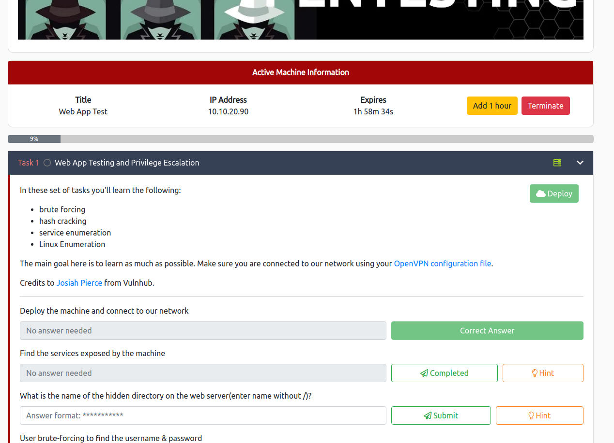

We start with the scan, launching nmap, gobuster and nikto.

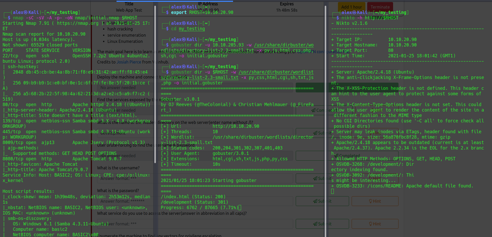

With this we can already find some interesting things, amongst them is already the answer to the first question: **What is the name of the hidden directory on the web server(enter name without /)?**

We can then take a look at the hidden directory that we found:

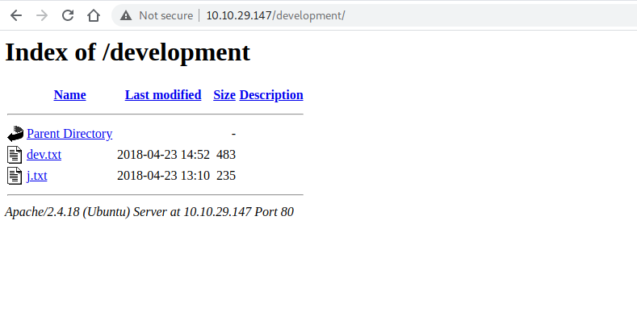

We then take a look at those files and 1 of them says that the passwords are not secure, we can try to brute force through smb with enum4linux:
The command used: enum4linux -A $RHOST | tee enum4linux.log  (I put the result in a log file).  
We can then see when we look at the file, at the end we see 2 usernames.

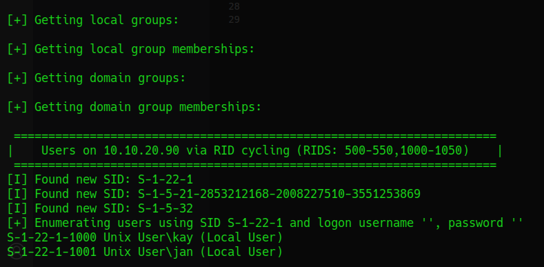

We can then try to bruteforce ssh, we remember that the documents actually was sent to the user "J" so we will try bruteforcing this username. 

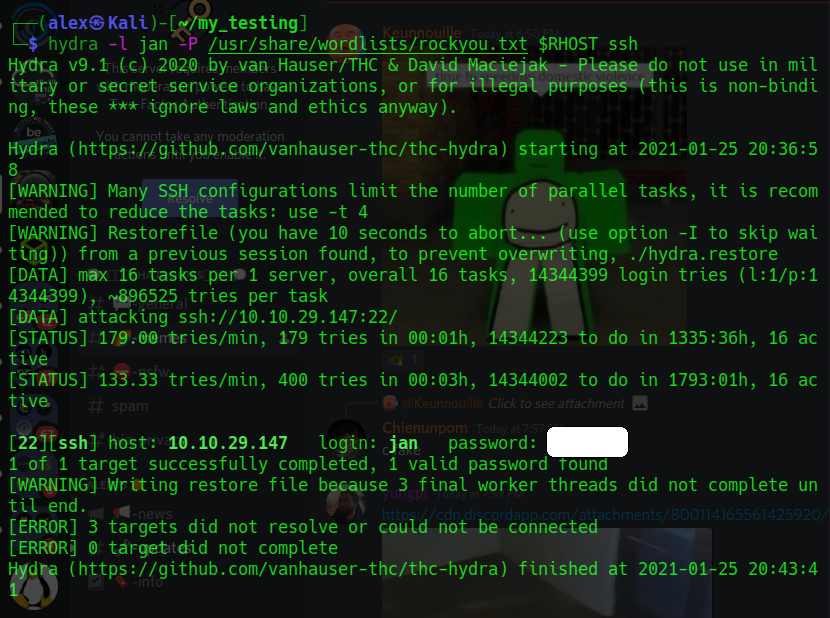

We can now answer to the next questions: **What is the username?** and **What is the password?**   
we also saw with nmap that we could access with ssh so we can do this right now.  

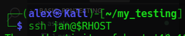

We connected succesfully, nothing can be done with "sudo -l" so we can try to pass linpeas.sh and LinEnum.sh with an http server to maybe escalate our privileges:

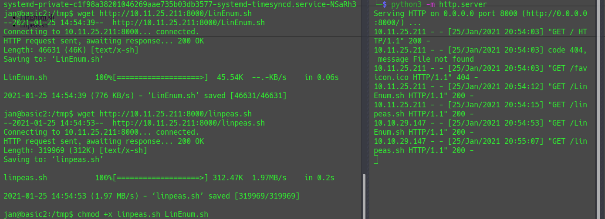

Don't forget to add executable on both files.  
We can then run them.

We then look for information, and we find something very interesing, a private ssh key, but for kay:

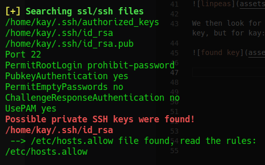

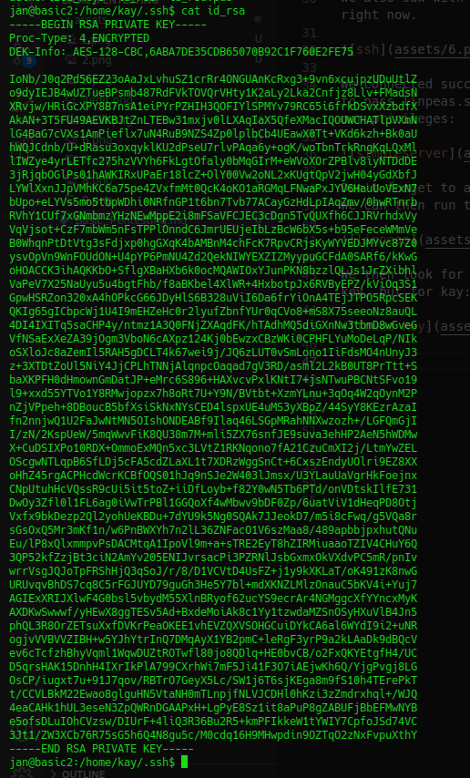

We then copy and paste it in a file on our machine, add permission 600 to it and try to ssh to this user, "kay".

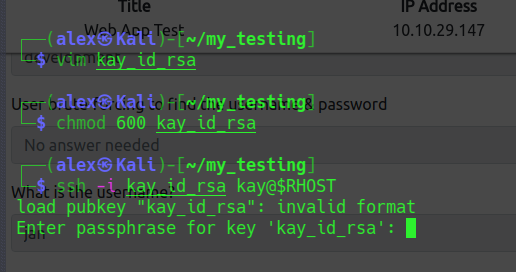

Next problem, we have a passphrase to find, luckily for us, john the ripper has a tool for this, ssh2john.  
We first need with the help of ssh2john to put the key in a readable file for john to crack it:

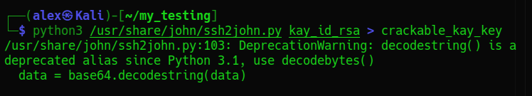

It is possible that the file is in another place, just find it with the command: *find / type -f -name ssh2john.py 2>/dev/null*  
So with this ssh2john we have created a file that is now crackable with the normal john syntax:

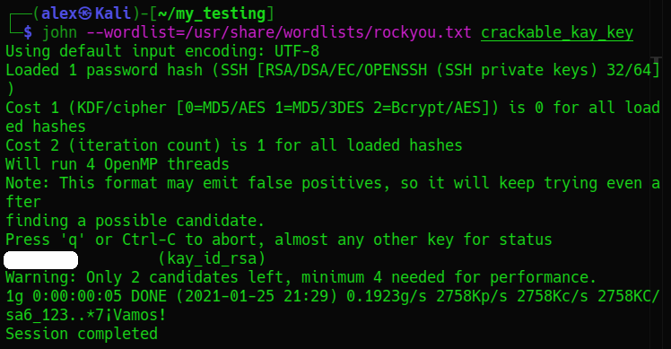

We now have the passphrase and can try again to ssh with the key:

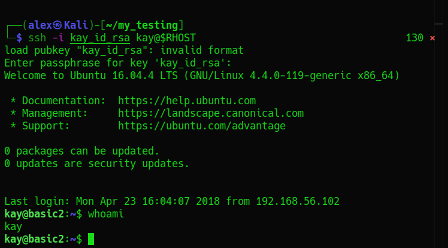

We are now successful and can directly read and answer the final question of this CTF:

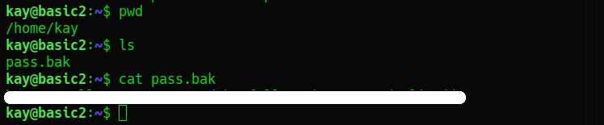

I hope it was clear.
Contact: alex.spiesberger@gmail.com

