# Bounty Hacker
## This is a pretty simple CTF:  
Name: Alexander Spiesberger  
Date: 1/02/2021  
email: alex.spiesberger@gmail.com   

---

We start and launch an nmap and find 3 ports open, with and ftp on it with anonymous, we connect to it:

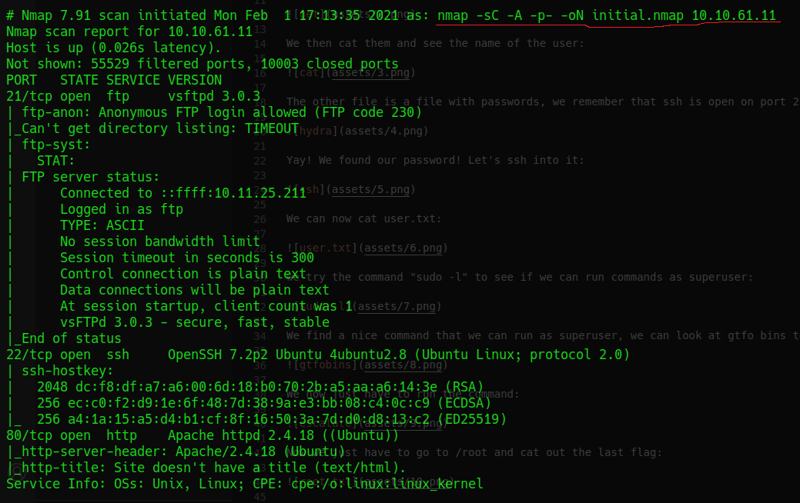
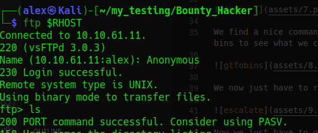

We see 2 documents and download them:

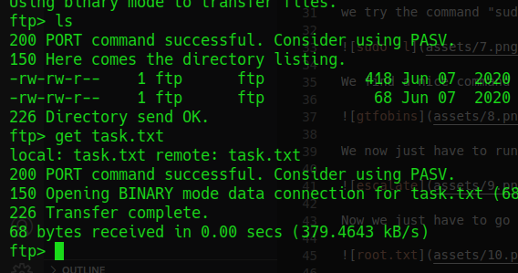

We then cat them and see the name of the user:

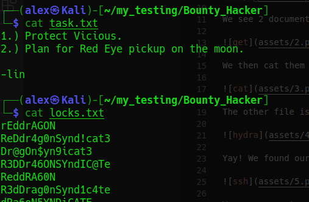

The other file is a file with passwords, we remember that ssh is open on port 22 so we could try to bruteforce it:

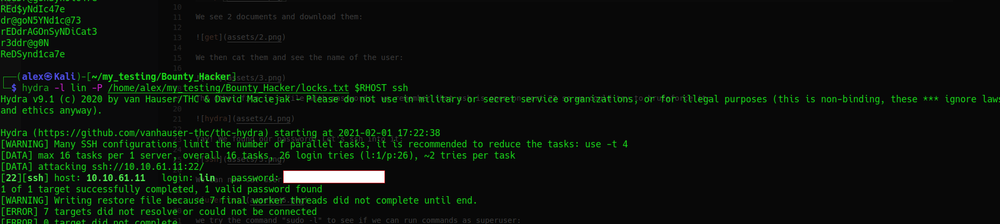

Yay! We found our password! Let's ssh into it:

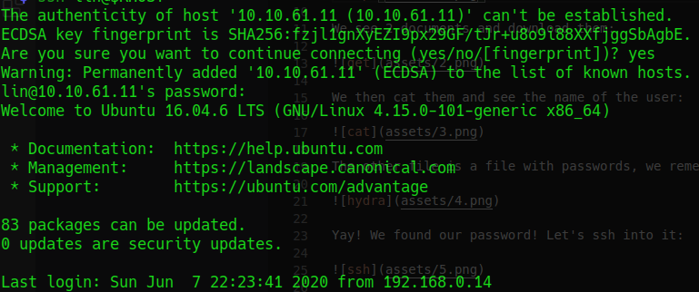

We can now cat user.txt:

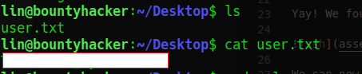

we try the command "sudo -l" to see if we can run commands as superuser:

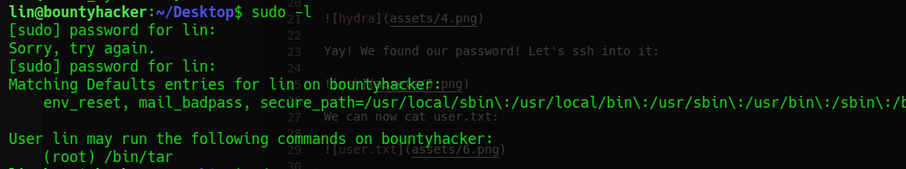

We find a nice command that we can run as superuser, we can look at gtfo bins to see what we can do with it:

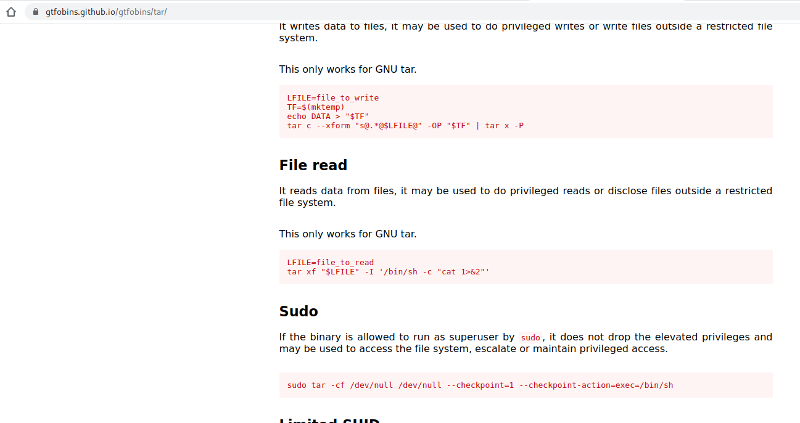

We now just have to run the command:

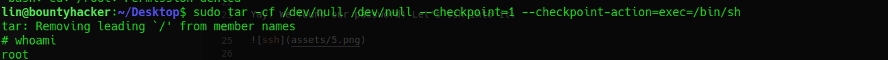

Now we just have to go to /root and cat out the last flag:

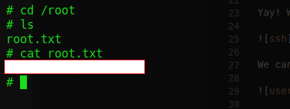

Hope it was useful.  
contact: alex.spiesberger@gmail.com