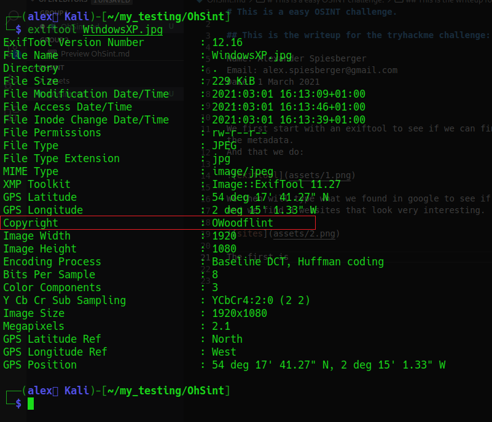
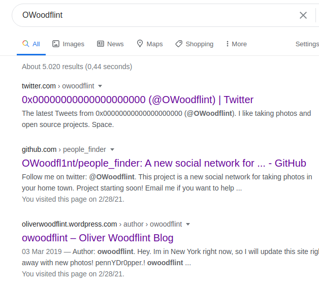
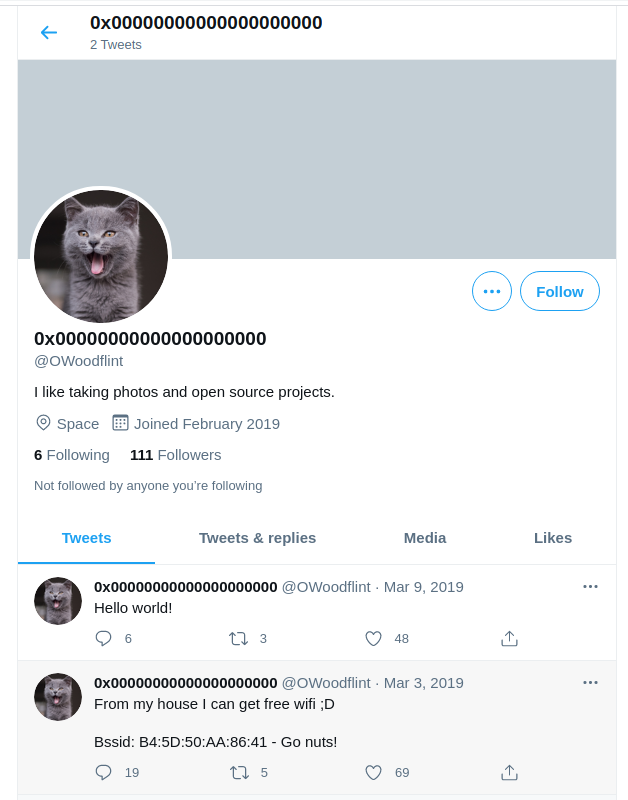
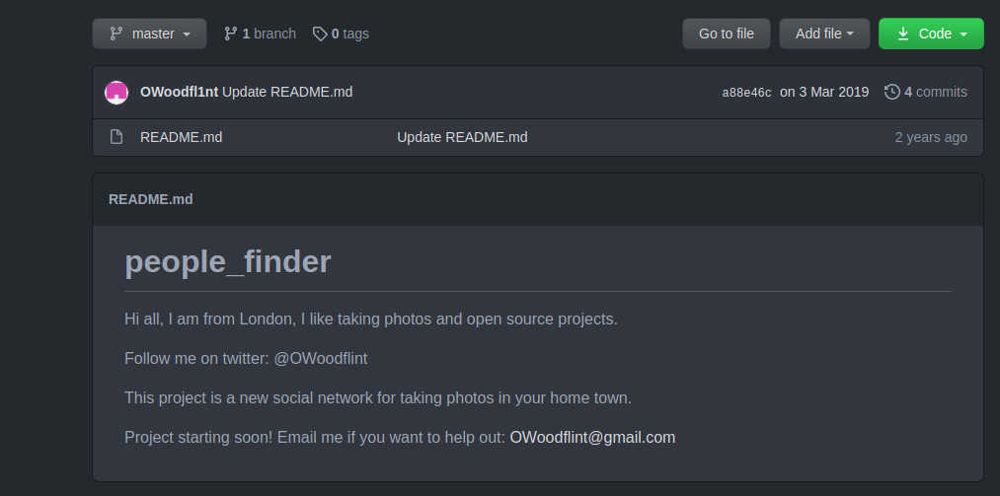
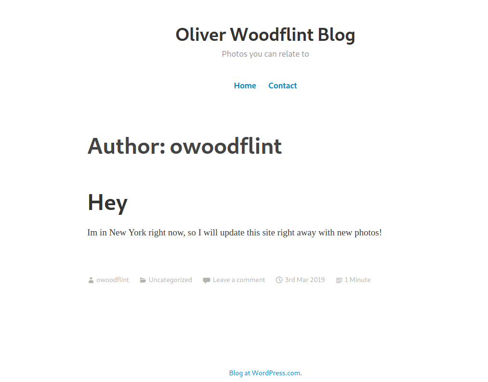
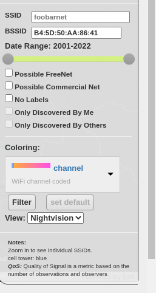
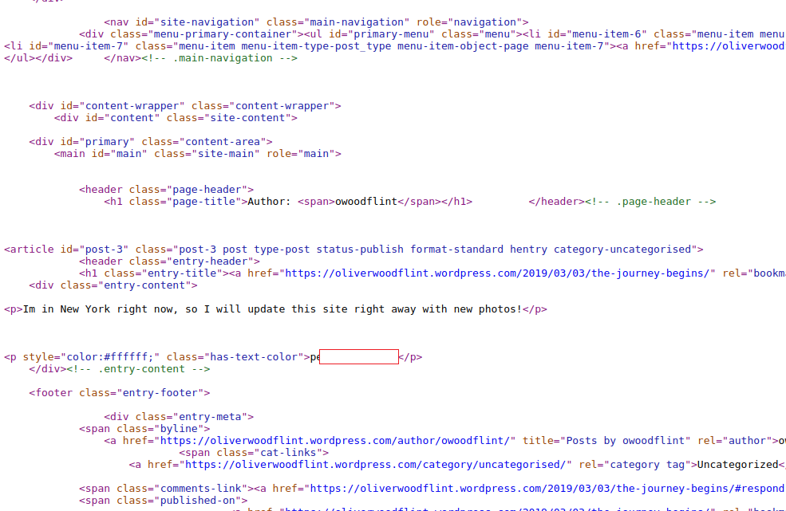

# This is a difficulty easy, OSINT challenge.

## This is the writeup for the tryhackme challenge: OhSint.  

Name: Alexander Spiesberger  
Contact: alex.spiesberger@gmail.com    
Date: 1 March 2021

----

We first start with an exiftool to see if we can find some interesting in the metadata.   
And that, we do:   

We then will type what we found in google to see if something appears!   
We find 3 websites that look very interesting.   

The first is a twitter account that tells us a BSSID.  
We will come back after to this.   

The second one is a Github repository/account.  
When going into it, this one, also has some interesting informations.  

The third one is a normal webpage, this one is also very important!

Sooo... We can now already respond to all these questions:   
- **What is this users avatar of?**  
- **What city is this person in?**
- **What is his personal email address?**
- **What site did you find his email address on?**
- **Where has he gone on holiday?**

This leaves us with the 2 last trickier questions.

We will first do the one with the BSSID that we found on the twitter page:  

So what we could use is wigle.net, and input the BSSID address in it:  

Ok, only 1 question left, this one was a bit annoying to find but when searching in the source code of the webpage you can find a password:  

And that is the response to the last question.  
Quick and fun challenge!   

I hope you enjoyed!   
For any questions you can send me an email: alex.spiesberger@gmail.com
