# RootMe

## This is a simple CTF

---

Name: Alexander Spiesberger   
Date: 03/02/2021   
contact: alex.spiesberger@gmail.com   

----

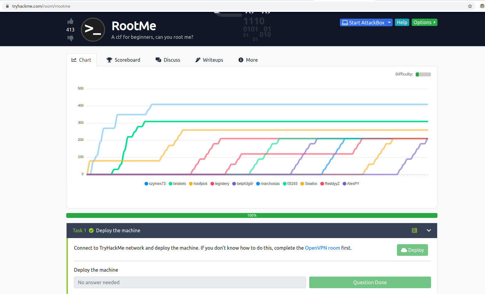

We start by launching nmap and gobuster 

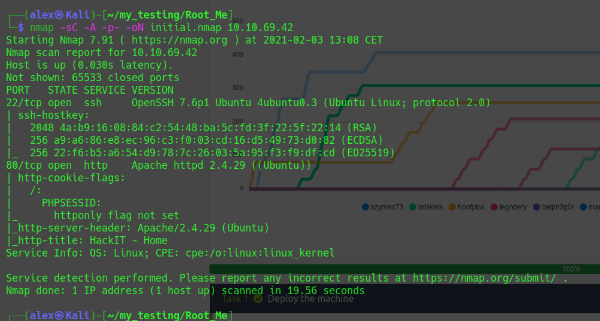

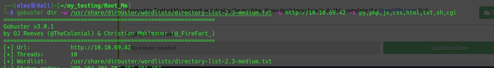

We then go on the web page but nothing:

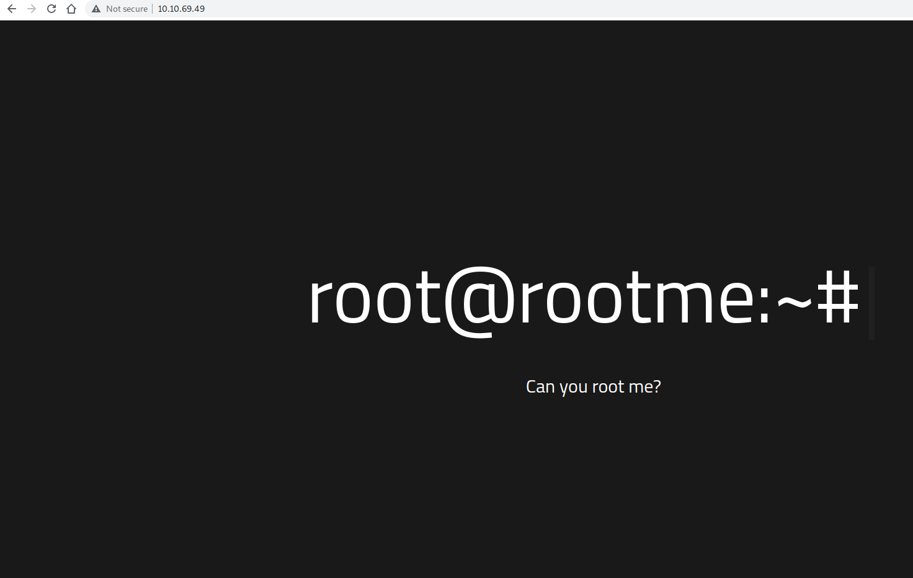  

BUUUT, gobuster find files, (uploads and panel)

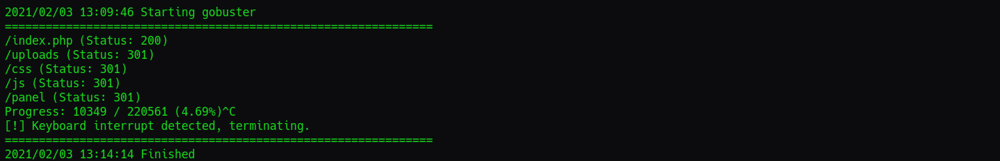

With nmap and gobuster we now can respond to all the questions in task 1 and 2.

We now go to panel and find a page were we can upload files.

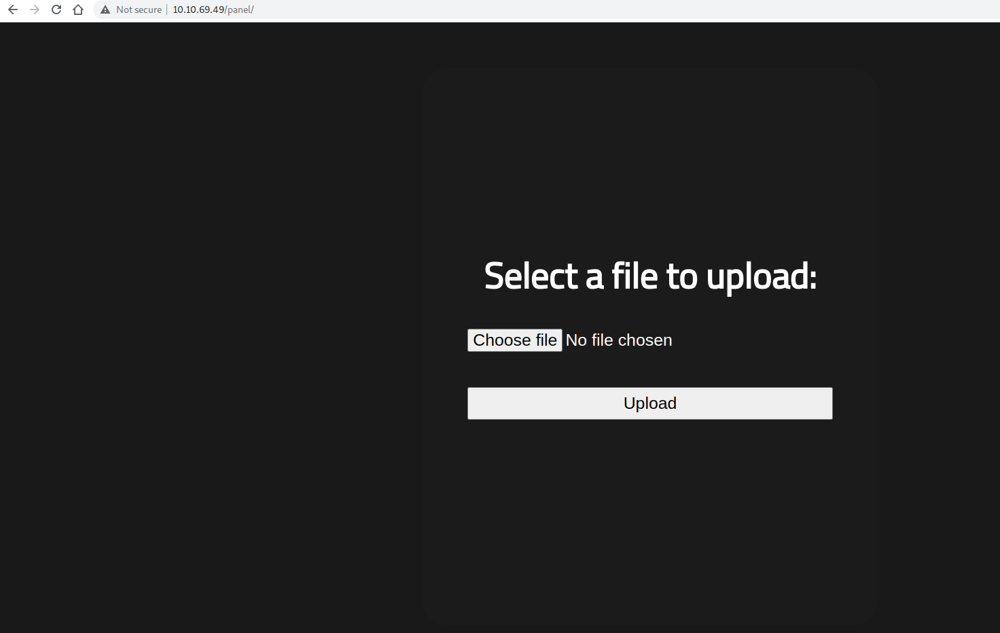

We try a reverse shell, I tried the php-reverse-shell that comes with kali linux in: /usr/share/webshells/php  
But when we upload it, it says that php isn't accepted.  

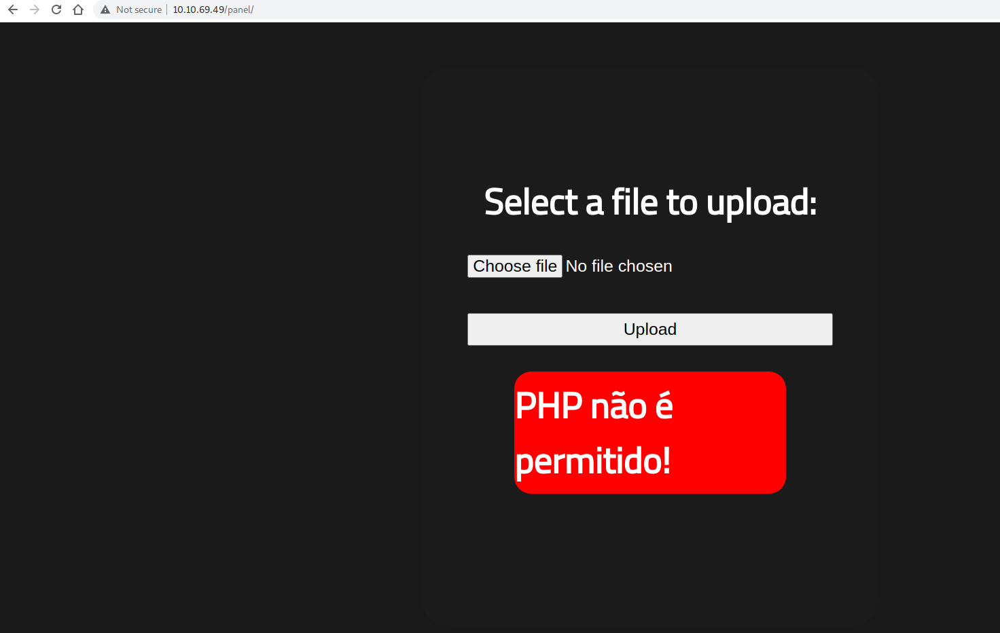

What we can try is to use another extension, for example: ".phtml"   

And this is a success!

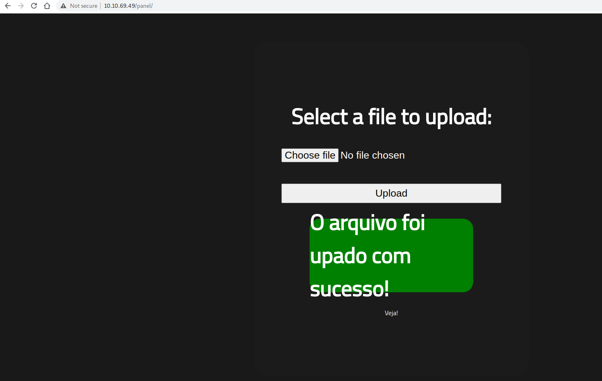

We now launch it on the other folder we found: uploads, and yay! we have a our reverse shell!

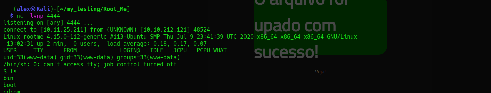

We now search for the user.txt:

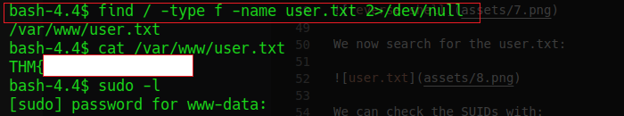

We can check the SUIDs with: 

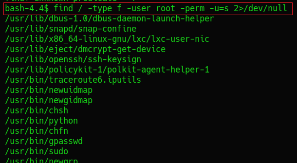

We find an interesting binary:  

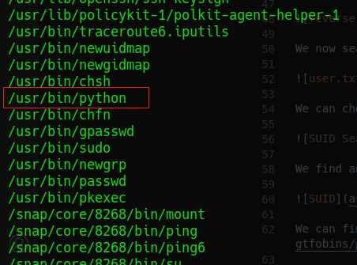

We can find on GTFOBins an escalation method: https://gtfobins.github.io/gtfobins/python/   

So we launch the command:

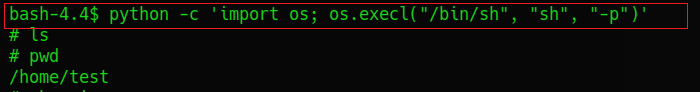

Yay! We are root! We can now search for root.txt

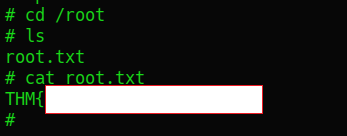

Hope you enjoyed the writeup of this CTF.  
contact: alex.spiesberger@gmail.com

