# Agent Sudo

Difficulty: Easy  
Date: 11/02/2021  
Name: Alexander Spiesberger  
Contact: alex.spiesberger@gmail.com   

This is a writeup of a simple CTF: **Agent Sudo**

---

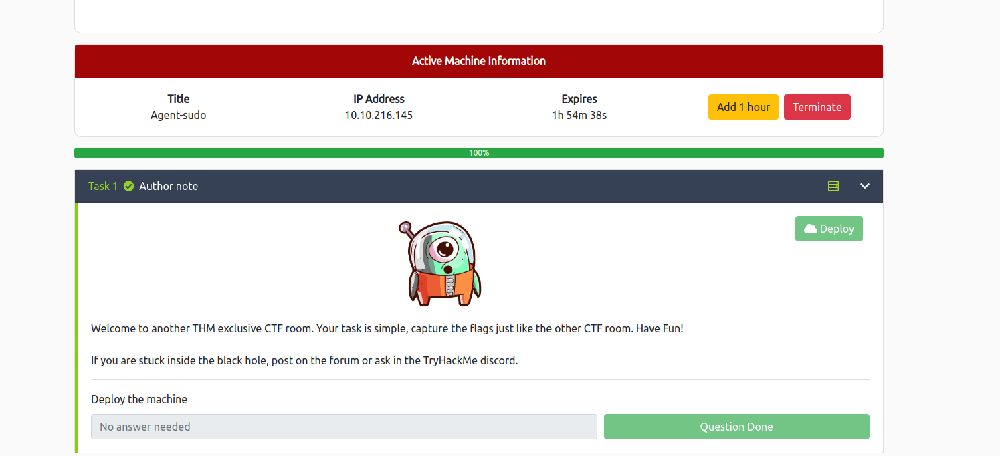

We start with an nmap:

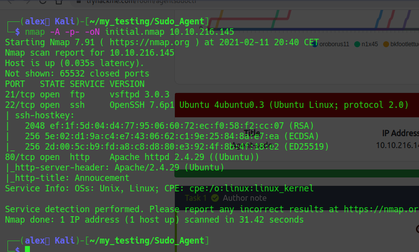

We see 3 open ports, we go and take a look at the http page:

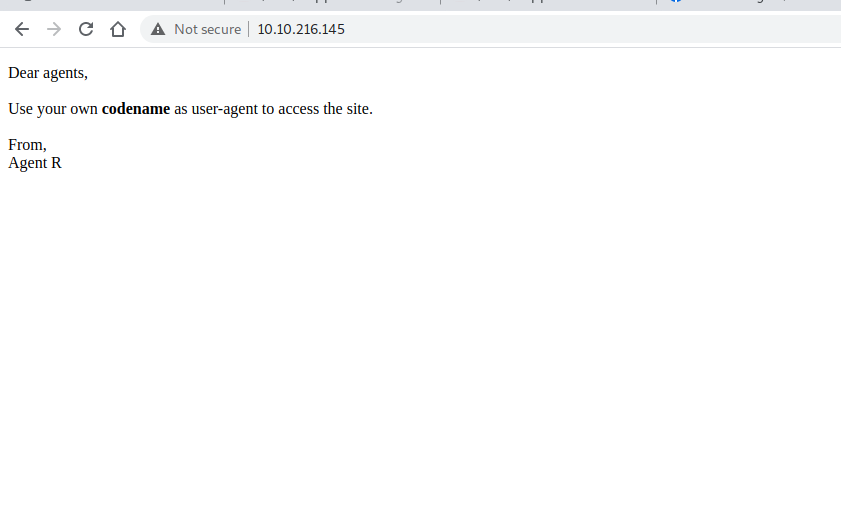

We see a small hint that says that we have to use our codename as user-agent to access the site, so what we can try is to change it with burpsuite, you could do it in the browser.

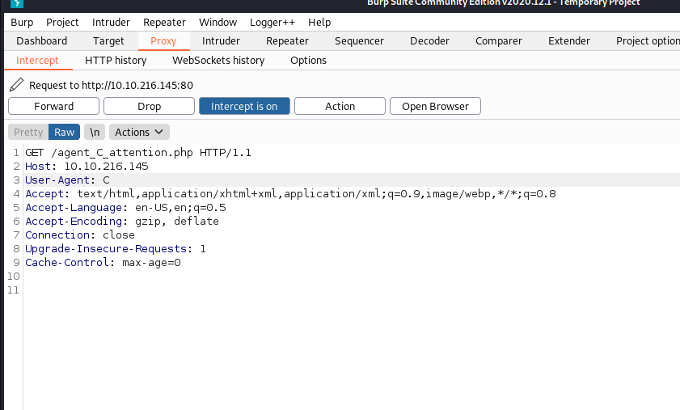

With the letter C, as shown in the screenshot we have access to a new page:

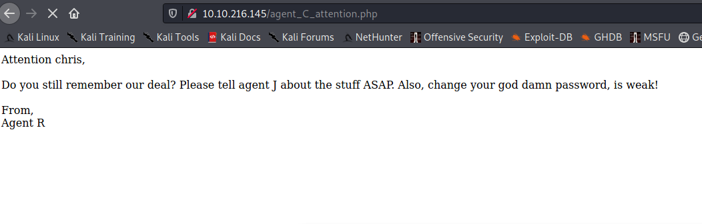

With this message we can take a look at what can be bruteforced.  
We see that a ftp port is open, we can try to brute this one with the username that we have:

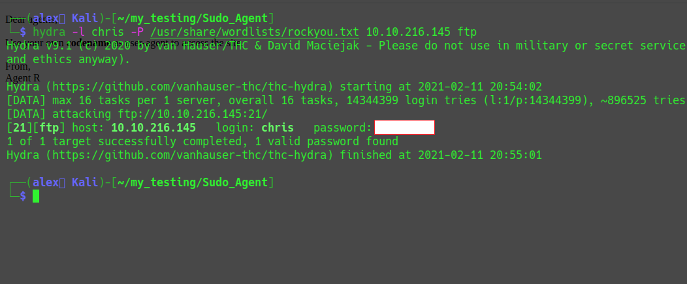

Yay! We got an ftp password!  
We can now connect to it:

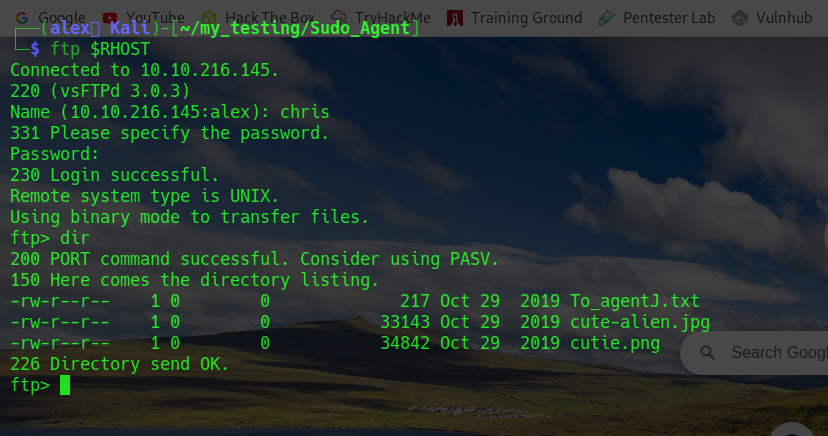

We see 3 fileS: 2 images and 1 txt file, we download it on our machine to take a look at it:

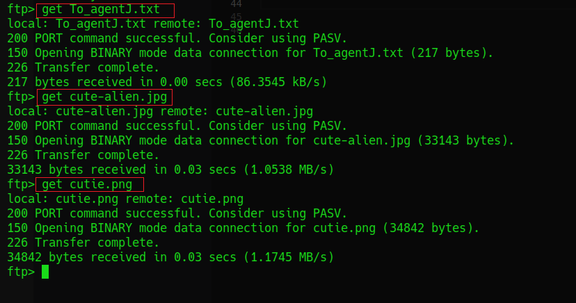

We read the txt file and see that it says that the photos are fake:

We try exiftool, nothing... we try steghide, ... passphrase.    
We can try to crack it with stegcrack but with binwalk we can extract a zip from cutie.png.

We have now a folder with what got extracted, we take a look at it, and see that the zip file needs a password, and we have an empty txt file:

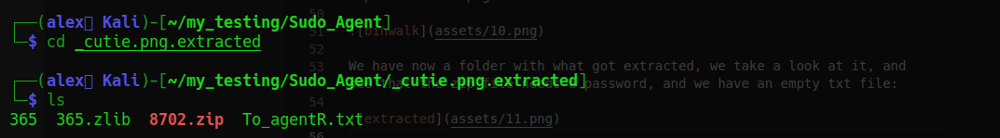

So we can try to crack it with zip2john:

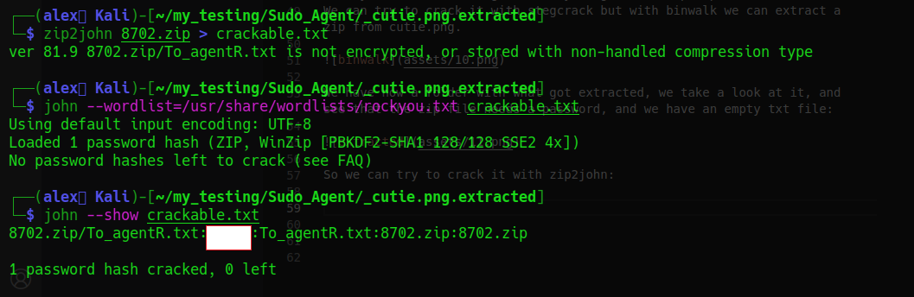

We can now open the zip, the unzip didn't work, so I used 7z:

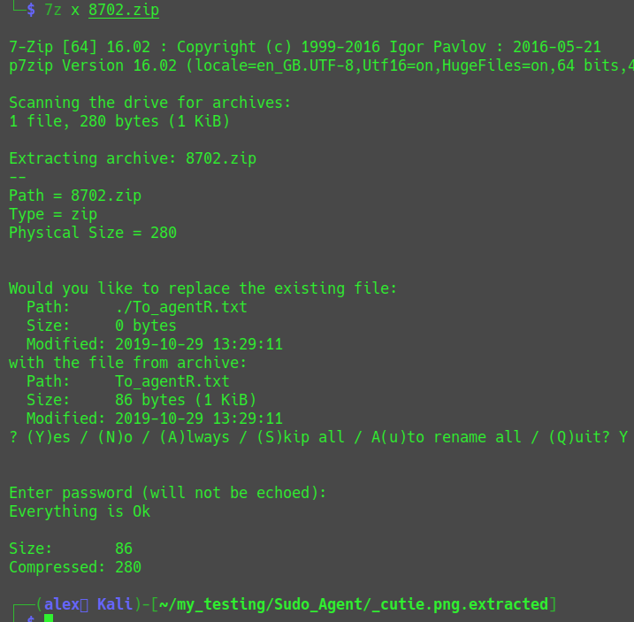

It extracted to the empty file: To_agentR.txt which gives us an encoded string:

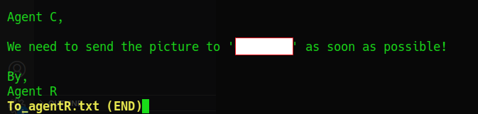

We can now decode it with base64:

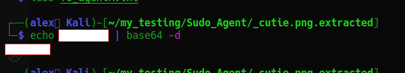

We maybe have our steghide passphrase now:

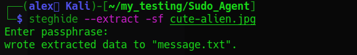

We now have extracted a txt file from this:

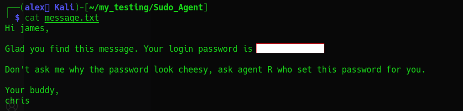

Pretty useful txt file!!    
We remember that ssh was open on port 22, so we can now try to ssh with what we just got!!

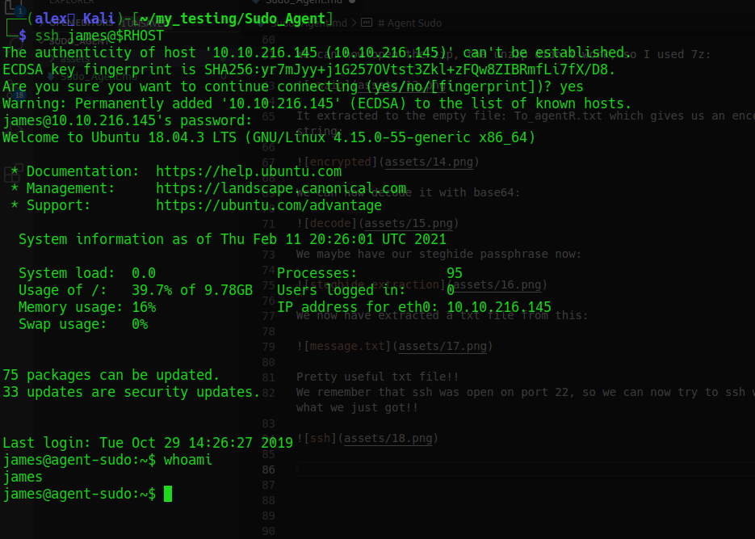

Yeah great that's a good step forward!
We can now read the user flag:

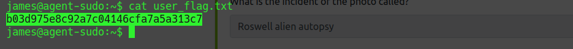

We find another image: **Alien_autospy.jpg**:

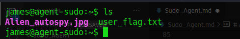

With a quick google search we can find what it is, not even needed to download the file, but if you want to download it we could do it with scp.

So we find out that the incident of the photo is called: *Roswell alien autopsy*  

We now have our last task, that is to escalate our privileges.  
We find with a simple "sudo -l" that something is possible there:  

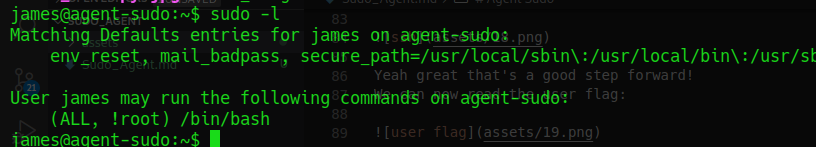

Just with copy pasting it into google, our first result is an exploit for this: 

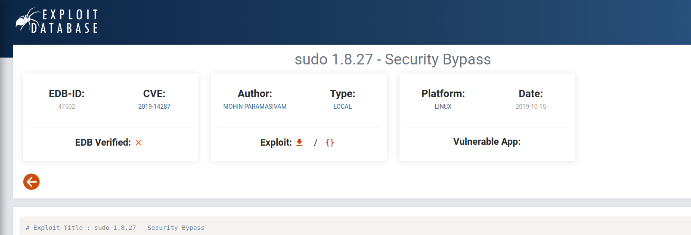

Quick reading through it, we find what we have to do:

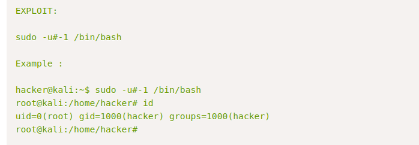

So the only thing that has to be done is to execute it:

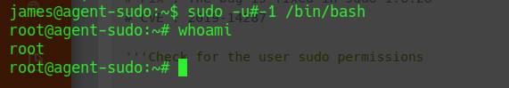

Last thing to do, go to /root and read our juicy root flag:

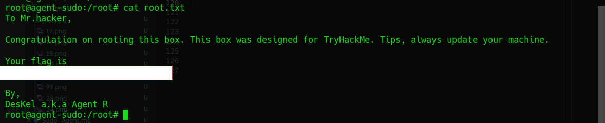

We even learn who the mysterious Agent R is! 

---

I hope you enjoyed my writeup, hopefully you learned as much new things as I did.   
Contact: alex.spiesberger@gmail.com 

