# This is the writeup of ToysRus

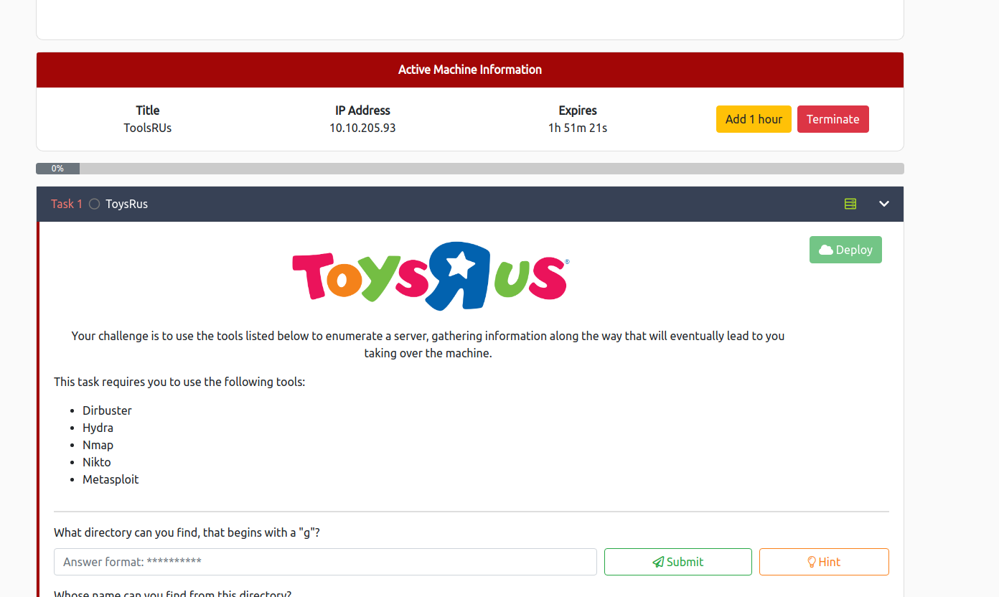

first I started: nikto, gobuster and nmap:

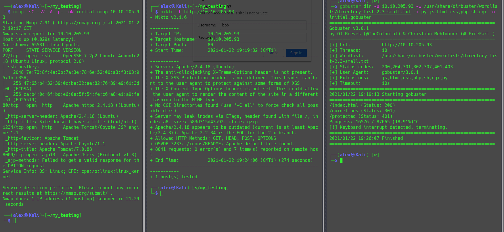

We find the answer to the first question with the gobuster, (**What directory can you find, that begins with a "g"?**)  
when going to this directory, we find the answer to the second question. (**Whose name can you find from this directory?**)  
With the same gobuster scan we then also find the answer to the third question: **What directory has basic authentication?**  

We then move onto the *protected* directory and see an authentication form:

We then try to bruteforce it with the username "bob" found previously.

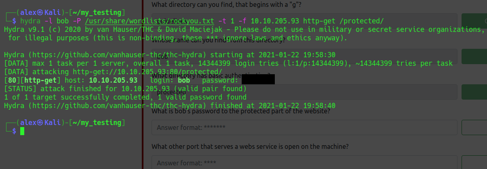

That gives us the answer to question number 4: **What is bob's password to the protected part of the website?**

But when logging into that page doesn't give us much just the information that we should look on another port.

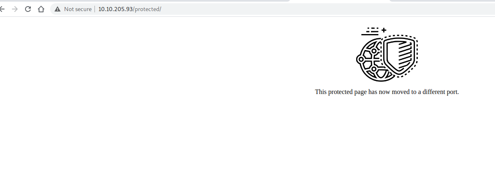

And question number 5 gives us a hint were to look (**What other port that serves a webs service is open on the machine?**).  
We still have our nmap file and we can see that *Apache Tomcat/Coyote JSP engine 1.1* was running on port 1234.

We then move to see what is going on on this port and we see this:  

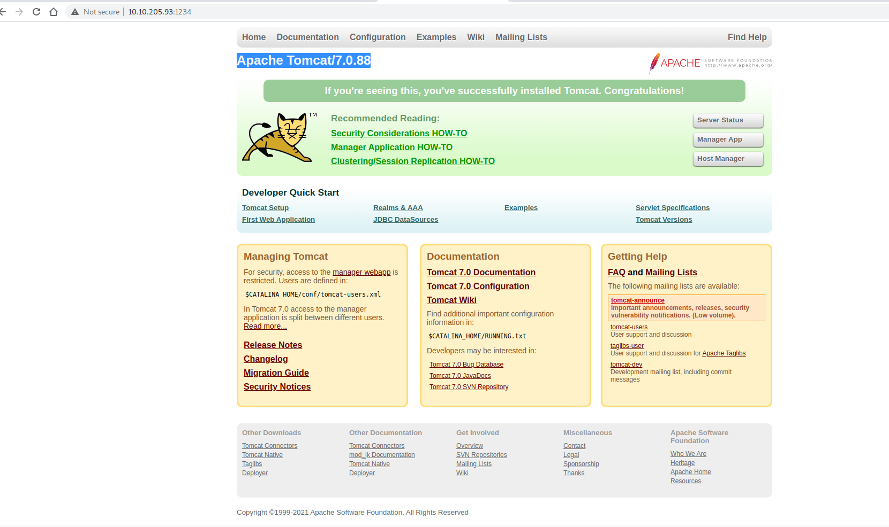

We can then reply to the question number 6: **what is the name and version of the software?**

When going on /manager/html or when looking at the nikto scan we can see the number of documentation.

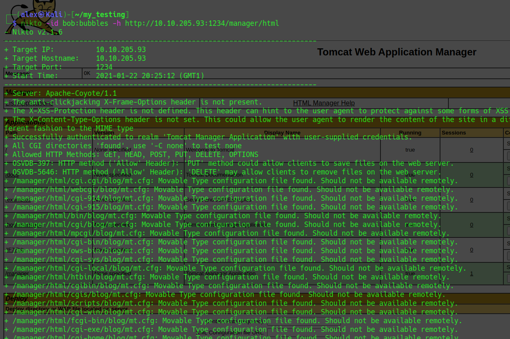

This is the response to question 7: **How many documentation files did Nikto identify?**

For question 8 (**What is the server version (run the scan against port 80)?**) we will go back to our nmap scan and look at the port 80.   

The nmap scan will also come handy for the question 9: **What version of Apache-Coyote is this service using?**

If we then search for our nmap result for port 1234 (*Apache Tomcat/Coyote JSP engine 1.1*) the first thing that comes up is this: https://charlesreid1.com/wiki/Metasploitable/Apache/Tomcat_and_Coyote  
And after a bit of research we can find a module to use with metasploit.  

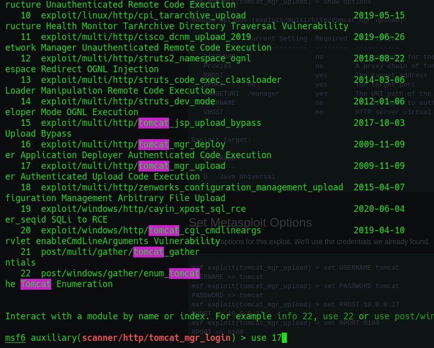

We then put the right options into it, the username and the password we found, then the RHOSTS and PORT.

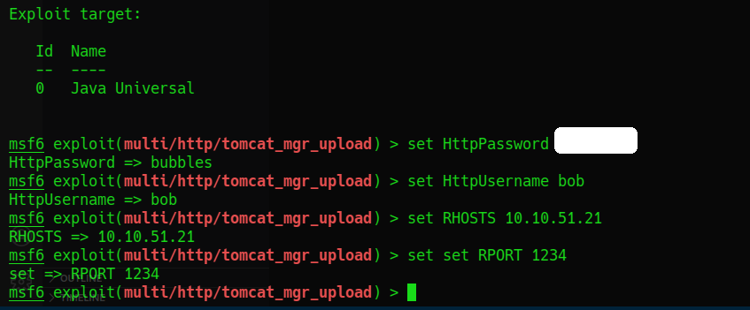

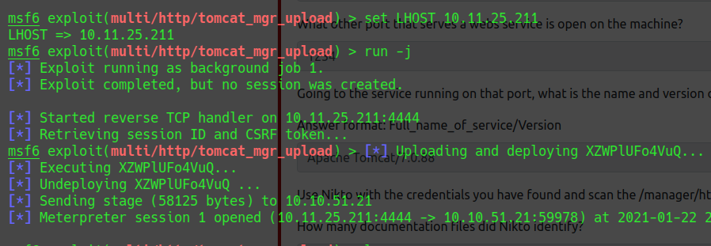

You should then have a created session, switch to it and see if it works.  

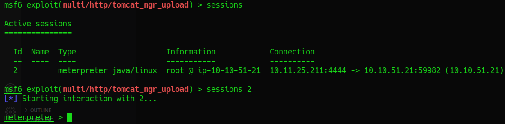

And here we are, root!  
Good Job!

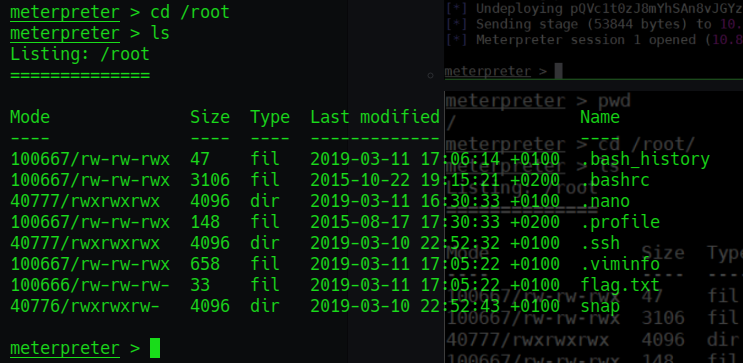

I hope it was clear!  
Contact: alex.spiesberger@gmail.com

