# This is a writeup of Mr Robot.
## Difficulty: Medium

----

Name: Alexander Spiesberger   
Date: 2 March 2021   
Contact: alex.spiesberger@gmail.com   

----

So this a very nice CTF: Mr Robot.

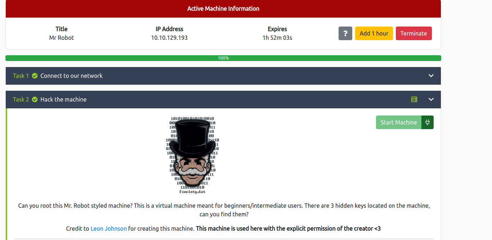

We launch nmap, nikto and gobuster:

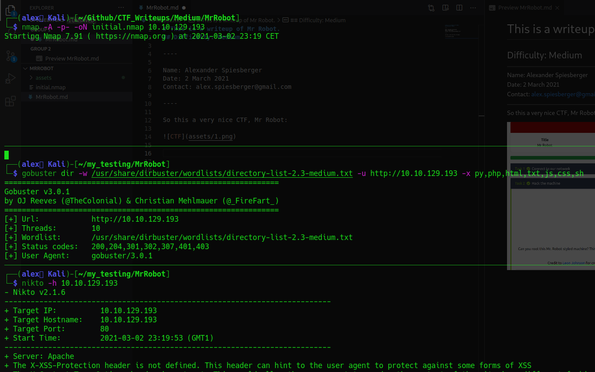

We then go and look a bit on the website that looks amazing:

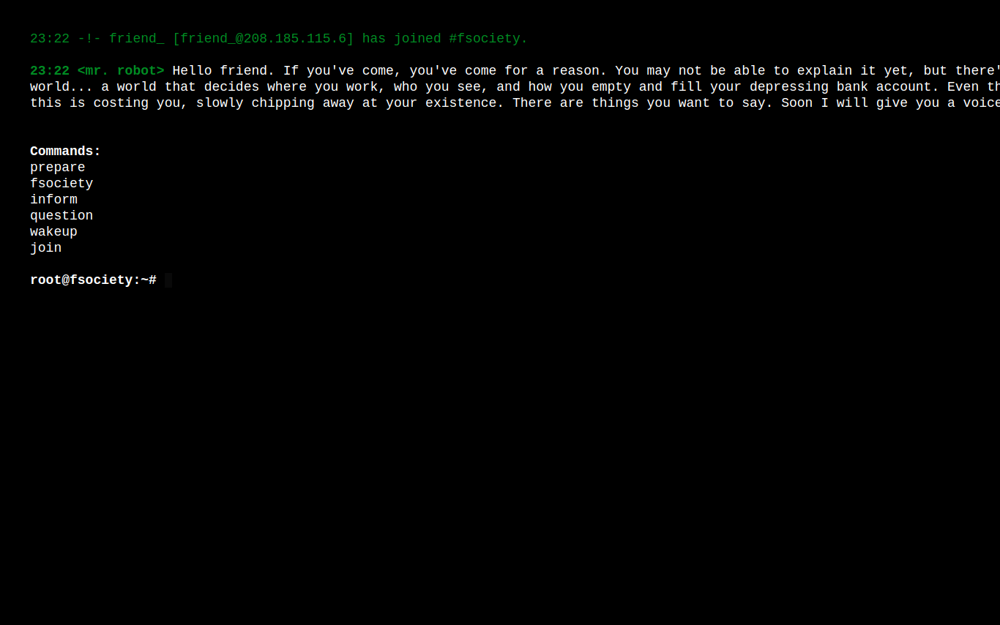

We can look a bit and I would suggest you do, because this CTF is really well done.     
But in this writeup I will go straight to the point.   

the gobuster gives us a lot of directories, some of them are very interesting.  
We will first take a look at robots.txt:   

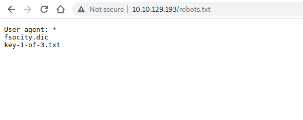

We first take a look at the the file: *key-1-of-3.txt*

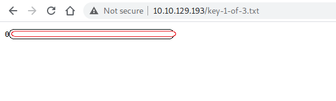

We already get the first key!   
Only 2 keys left.   

Let's look at the other file: *fsocity.dic*

As seen in the image it looks like a dictionnary.   
We download it:

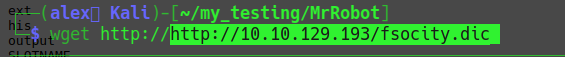

We look a bit around and we find something interesting when scrolling on /license.txt:   

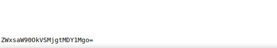

It looks like base64 so we take it and decode it:

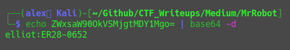

This looks like credentials, we try them and ... are now logged in:   

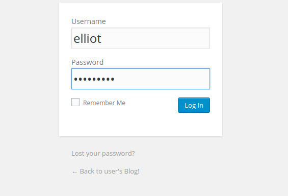

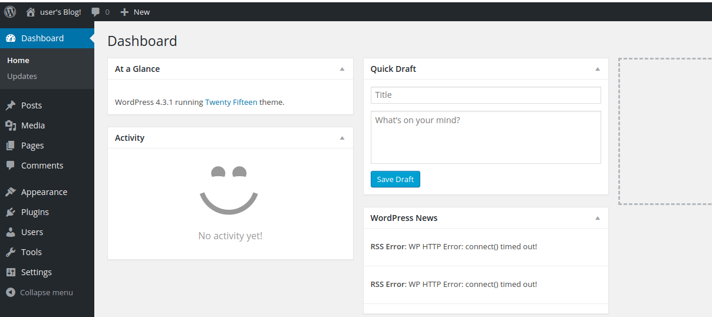

After a bit of research I found a way on how to include a file.  
You can go to appearance, Editor and then take a template to edit.  

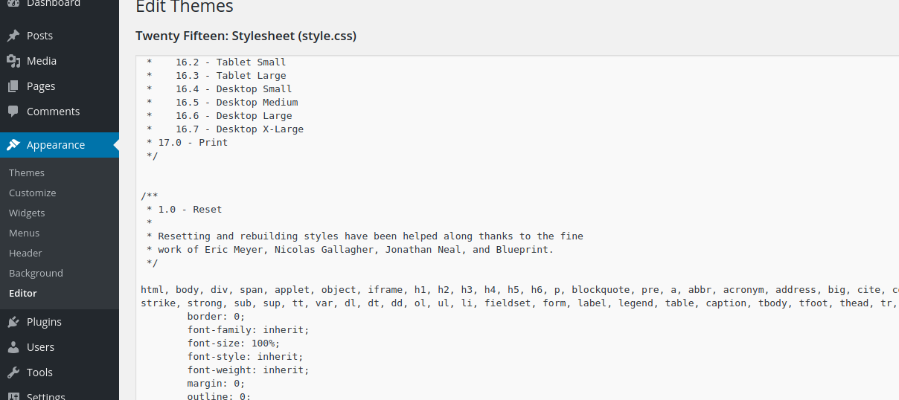

I took the 404 page and copied the php reverse shell inside it.   
If you don't have the php reverse shell in your php webshells you can find it here: https://github.com/pentestmonkey/php-reverse-shell/blob/master/php-reverse-shell.php

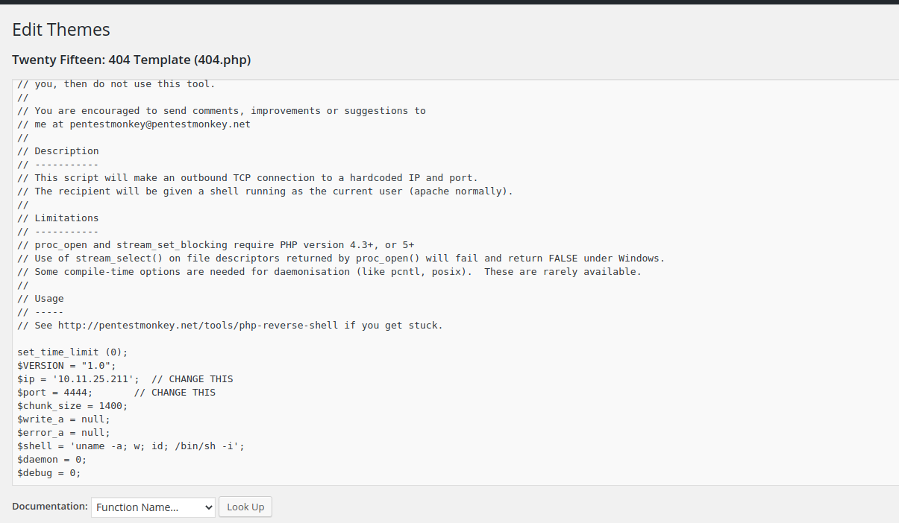

Don't forget to change the IP and PORT in the webshell.  
We now have to go into this webpage with a listener running on our machine:   

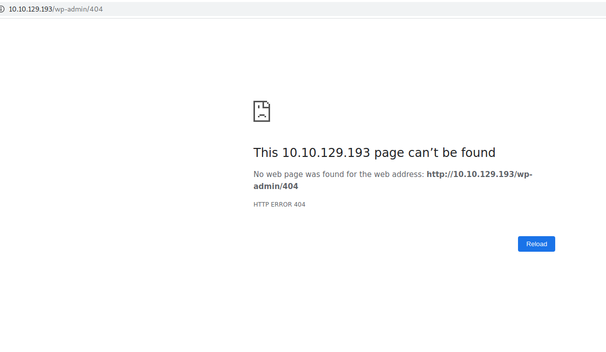

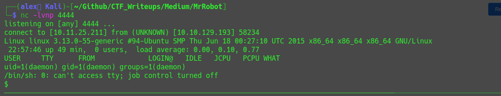

So, we are now connected on the machine.   
We will now stabilise it with the basic python commands:

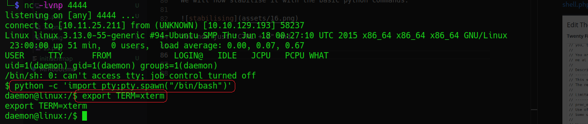

You now just "CTRL + Z" and:

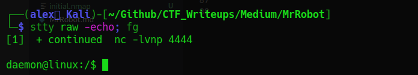

We now have a stable web shell!

When going to the user (/home/robot), we find a file with the name *key-2-of-3.txt* and a file with a password:  

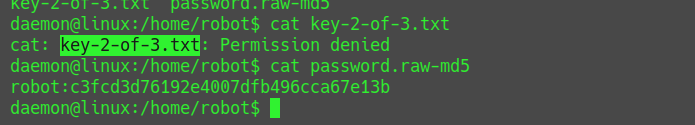

We can now crack it with john, but I actually just put it in crackstation and in 2 seconds, it is cracked:  

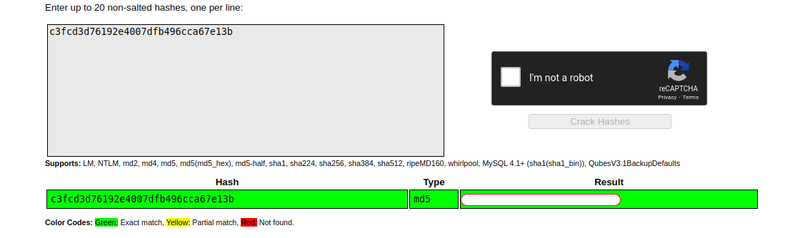

We can now change user with this password and read the 2nd key:

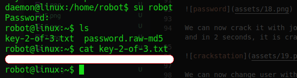

Ok, only 1 key left!

I tried "sudo -l" but nothing.  
So I sent linpeas.sh on the machine.     
If you don't know how to transfer files, the easiest way is to boot up a python server with: "python3 -m http.server".   
And then wget it on the other machine.   
You then probably need to go to /tmp directory to pull it, then put the permissions on it and finally run it:

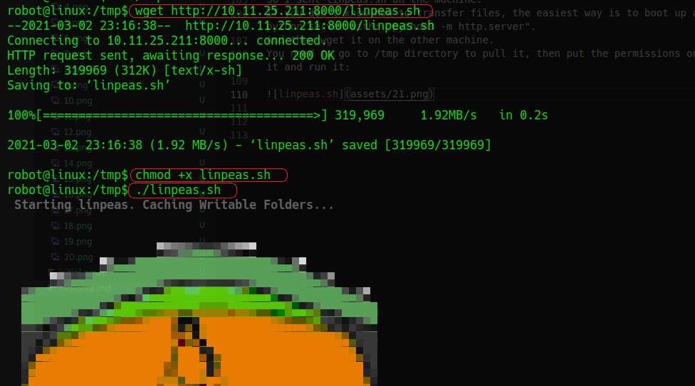

In the output, section: *"Interesting Files"* we find something that could potentially make us escalate those sweet privileges:  

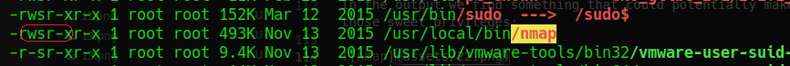

We see SUID bit set and on gtfobins there is something that could help us:

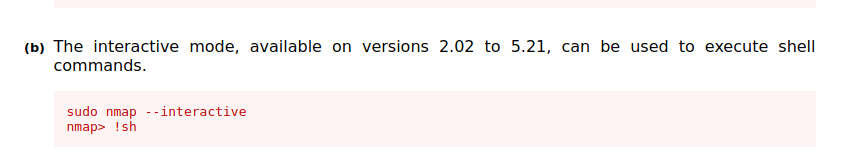

So we will try to use this:

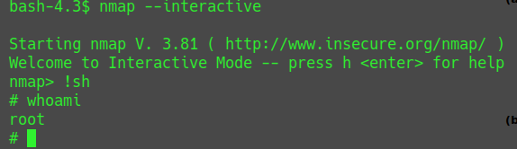

AAAND, Done! We are now root!
We can go and read the last flag at /root:

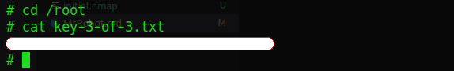

We are now done!

----

I hope you enjoyed my walkthrough!  
You can contact me for questions or other subjects on this address: alex.spiesberger@gmail.com

